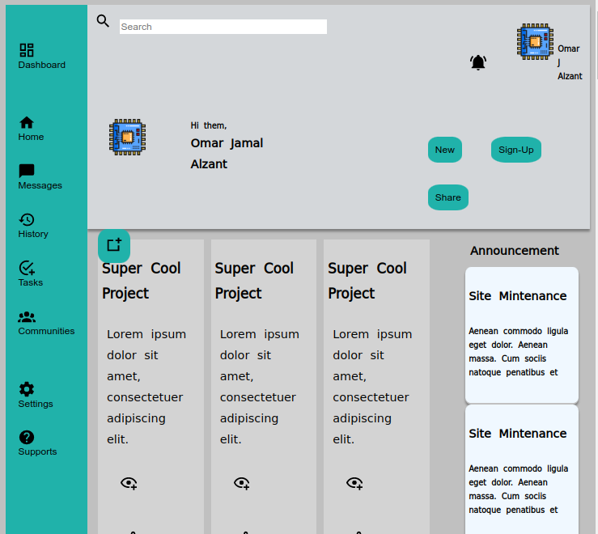

</br>
</br>

We use :


---

</br>
</br>

You can
<a href="https://omar-alzant.github.io/Admin-Dashboard/">
Test-it
</a>.

---

</br>
</br>

The result :



---

</br>
</br>

Code -CSS- :

```css
body {
  display: grid;
  grid-template: 1fr 2fr 5fr 5fr 5fr /2fr 5fr 5fr 5fr 5fr;
  background-color: silver;
}

p {
  padding: 5px;
  margin: 2px;
  /* border: 2px ridge; */
  /* display: block;
    margin-block-start: 1px;
    margin-block-end: 1px;
    margin-inline-start: 1px;
    margin-inline-end: 1px */
}
header {
  grid-column: 2/6;
  grid-row: 1/2;
  display: grid;
  grid-template: 2fr 2fr / 1fr;
  gap: 5px;
  box-shadow: 0 4px 3px 0 rgba(0, 0, 0, 0.2), 0 3px 3px 0 rgba(0, 0, 0, 0.19);
}

header > .part1 {
  display: grid;
  grid-template-columns: 5fr 2fr;
  margin: 10px;
  margin-bottom: 0;
  gap: 5px;
}
#notification {
  cursor: pointer;
  border: none;
  background-color: transparent;
  padding: 10px 20px;
  border-radius: 40%;
  box-shadow: none;
}
input[type="search"] {
  border: none;
  border-style: inherit;
  height: 20px;
  width: clamp(15vw, 60%, 85%);
}

.notifi {
  display: flex;
  gap: 6px;
}

header > .part2 {
  display: grid;
  grid-template-columns: 2fr 2fr 6fr;
  margin-top: 0;
}

section {
  grid-column: 1/2;
  grid-row: 1/6;
}

section button {
  background-color: transparent;
  text-align: center;
  color: black;
  margin: 7px;
}
.main {
  grid-column: 2/6;
  grid-row: 2/6;
  display: grid;
  grid-template-columns: 6fr 2fr;
  gap: 5px;
}
.grid-title {
  grid-column: 1/2;
  display: grid;
  grid-template: 8% 8% 8% / 30% 30% 30%;
  margin: 15px;
  gap: 10px;
}
.grid-itme {
  background-color: lightgrey;
  padding: 5px;
}
/* 
.grid-itme label , .grid-itme input{
    width: auto ;
    overflow: auto;
    height: 20vw;
} */
.grid-itme::before {
  content: "";
  position: absolute;
  width: 3px;
  height: auto;
  left: 0;
  top: 0;
  background-color: rgb(235, 207, 51);
}
.main .part {
  grid-column: 2/2;
  margin-top: 10px;
  margin-right: 15px;
}
.main .part #p1 {
  border-bottom: 3px solid silver;
  background-color: aliceblue;
  padding: 5px;
  box-shadow: 0 3px 3px 0 rgba(0, 0, 0, 0.2), 0 3px 3px 0 rgba(0, 0, 0, 0.19);
  border-radius: 5%;
  height: clamp(50vh, auto, 20vh);
}
/* .main .part2{
    grid-column: 2/2;
    margin-top: 15px;
}
.main .part2 #p2{
    border-bottom: 3px solid silver;
    background-color: aliceblue;
    padding: 5px;
    box-shadow: 0 3px 3px 0 rgba(0,0,0,0.2), 0 3px 3px 0 rgba(0,0,0,0.19);
    border-radius: 5%;
    height: auto ;
} */

button {
  cursor: pointer;
  border: none;
  background-color: lightseagreen;
  color: black;
  padding: 10px;
  /* text-align: start; */
  text-decoration: none;
  border-radius: 30%;
  /* align-items: center; */
  margin: 15px;
}

button:hover {
  box-shadow: 0 3px 3px 0 rgba(0, 0, 0, 0.2), 0 3px 3px 0 rgba(0, 0, 0, 0.19);
}

.svg button {
  cursor: pointer;
  border: none;
  background-color: transparent;
}

.dash {
  display: grid;
  padding: auto;
}

@media screen and (max-width: 800px) {
  .grid-itme {
    grid-template: auto auto auto / auto auto auto;
  }

  header > .part1 {
    display: grid;
    grid-template-columns: 10vw 10vw;
    grid-template-rows: 10vw 10vw;
    margin: 10px;
    margin-bottom: 0;
    gap: 5px;
  }

  header > .part2 {
    display: grid;
    grid-template-columns: auto auto auto;
    margin-top: 0;
  }
}
```

---

</br>
</br>

Code -JS- :

```javascript
function add() {
  const unknown = document.querySelector(".grid-title");
  unknown.innerHTML += `<div class="grid-itme"  > 
    <label for="in1"> Project-Name: </label>
    <input type="text" id="in1" placeholder="Title">
    <label for="t1"> Description:</label>
    <textarea name="msg" id="t1" maxlength="150" rows="10"></textarea>      
      <div class="svg" >
            <button> <svg xmlns="http://www.w3.org/2000/svg" xmlns:xlink="http://www.w3.org/1999/xlink" version="1.1" width="24" height="24" viewBox="0 0 24 24"><path d="M12,4.5C7,4.5 2.73,7.61 1,12C2.73,16.39 7,19.5 12,19.5C12.36,19.5 12.72,19.5 13.08,19.45C13.03,19.13 13,18.82 13,18.5C13,18.14 13.04,17.78 13.1,17.42C12.74,17.46 12.37,17.5 12,17.5C8.24,17.5 4.83,15.36 3.18,12C4.83,8.64 8.24,6.5 12,6.5C15.76,6.5 19.17,8.64 20.82,12C20.7,12.24 20.56,12.45 20.43,12.68C21.09,12.84 21.72,13.11 22.29,13.5C22.56,13 22.8,12.5 23,12C21.27,7.61 17,4.5 12,4.5M12,9A3,3 0 0,0 9,12A3,3 0 0,0 12,15A3,3 0 0,0 15,12A3,3 0 0,0 12,9M18,14.5V17.5H15V19.5H18V22.5H20V19.5H23V17.5H20V14.5H18Z" /></svg></button>
            <button><svg xmlns="http://www.w3.org/2000/svg" xmlns:xlink="http://www.w3.org/1999/xlink" version="1.1" width="24" height="24" viewBox="0 0 24 24"><path d="M18 16.08C17.24 16.08 16.56 16.38 16.04 16.85L8.91 12.7C8.96 12.47 9 12.24 9 12S8.96 11.53 8.91 11.3L15.96 7.19C16.5 7.69 17.21 8 18 8C19.66 8 21 6.66 21 5S19.66 2 18 2 15 3.34 15 5C15 5.24 15.04 5.47 15.09 5.7L8.04 9.81C7.5 9.31 6.79 9 6 9C4.34 9 3 10.34 3 12S4.34 15 6 15C6.79 15 7.5 14.69 8.04 14.19L15.16 18.34C15.11 18.55 15.08 18.77 15.08 19C15.08 20.61 16.39 21.91 18 21.91S20.92 20.61 20.92 19C20.92 17.39 19.61 16.08 18 16.08M18 4C18.55 4 19 4.45 19 5S18.55 6 18 6 17 5.55 17 5 17.45 4 18 4M6 13C5.45 13 5 12.55 5 12S5.45 11 6 11 7 11.45 7 12 6.55 13 6 13M18 20C17.45 20 17 19.55 17 19S17.45 18 18 18 19 18.45 19 19 18.55 20 18 20Z" /></svg></button>
            <button> <svg xmlns="http://www.w3.org/2000/svg" xmlns:xlink="http://www.w3.org/1999/xlink" version="1.1" width="24" height="24" viewBox="0 0 24 24"><path d="M5.8 21L7.4 14L2 9.2L9.2 8.6L12 2L14.8 8.6L22 9.2L18.8 12H18C17.3 12 16.6 12.1 15.9 12.4L18.1 10.5L13.7 10.1L12 6.1L10.3 10.1L5.9 10.5L9.2 13.4L8.2 17.7L12 15.4L12.5 15.7C12.3 16.2 12.1 16.8 12.1 17.3L5.8 21M17 14V17H14V19H17V22H19V19H22V17H19V14H17Z" /></svg>  </button>         
         </div>
     </div>
    
    
    </div>`;
}
```

---

</br>
</br>

Code -Html- :

```html
<!DOCTYPE html>
<html lang="en">
  <head>
    <meta charset="UTF-8" />
    <meta http-equiv="X-UA-Compatible" content="IE=edge" />
    <meta name="viewport" content="width=device-width, initial-scale=1.0" />
    <link rel="stylesheet" href="css/style.css" />
    <title>Admin-DashBoard</title>
  </head>

  <body>
    <header style="background-color: rgb(212, 215, 218)">
      <div class="part1">
        <div>
          <label for="search">
            <svg
              xmlns="http://www.w3.org/2000/svg"
              xmlns:xlink="http://www.w3.org/1999/xlink"
              version="1.1"
              width="24"
              height="24"
              viewBox="0 0 24 24"><path
                d="M9.5,3A6.5,6.5 0 0,1 16,9.5C16,11.11 15.41,12.59 14.44,13.73L14.71,14H15.5L20.5,19L19,20.5L14,15.5V14.71L13.73,14.44C12.59,15.41 11.11,16 9.5,16A6.5,6.5 0 0,1 3,9.5A6.5,6.5 0 0,1 9.5,3M9.5,5C7,5 5,7 5,9.5C5,12 7,14 9.5,14C12,14 14,12 14,9.5C14,7 12,5 9.5,5Z"/></svg>
          </label>
          <input type="search" name="search" placeholder="Search" id="search" />
        </div>

        <div class="notifi">
          <button id="notification">
            <svg
              xmlns="http://www.w3.org/2000/svg"
              xmlns:xlink="http://www.w3.org/1999/xlink"
              version="1.1"
              width="24"
              height="24"
              viewBox="0 0 24 24"><path
                d="M21,19V20H3V19L5,17V11C5,7.9 7.03,5.17 10,4.29C10,4.19 10,4.1 10,4A2,2 0 0,1 12,2A2,2 0 0,1 14,4C14,4.1 14,4.19 14,4.29C16.97,5.17 19,7.9 19,11V17L21,19M14,21A2,2 0 0,1 12,23A2,2 0 0,1 10,21M19.75,3.19L18.33,4.61C20.04,6.3 21,8.6 21,11H23C23,8.07 21.84,5.25 19.75,3.19M1,11H3C3,8.6 3.96,6.3 5.67,4.61L4.25,3.19C2.16,5.25 1,8.07 1,11Z"
              />     </svg>
          </button>

          

          <h6 style="margin: 0; align-self: center">Omar J Alzant</h6>
        </div>
      </div>

      <div class="part2">
        
        <div style=" padding: 2px; margin-left: clamp(-7vw,auto,0); ">
          <h6 style="margin: 0; margin-left: 2px">Hi them,</h6>
          <h4 style="margin: 0; margin-left: 2px">Omar Jamal Alzant</h4>
        </div>
        <div style=" margin-left: 20vw; padding: 10px">
          <button>New</button>

          <a href="Sign-Up.html"> <button>Sign-Up</button></a>

          <button>Share</button>
        </div>
      </div>
    </header>

    <section style="background-color: lightseagreen">
      <button class="dash" style="margin-top: 40px; margin-bottom: 40px;">
        <svg
          xmlns="http://www.w3.org/2000/svg"
          xmlns:xlink="http://www.w3.org/1999/xlink"
          version="1.1"
          width="24"
          height="24"
          viewBox="0 0 24 24"
        >
          <path
            d="M19,5V7H15V5H19M9,5V11H5V5H9M19,13V19H15V13H19M9,17V19H5V17H9M21,3H13V9H21V3M11,3H3V13H11V3M21,11H13V21H21V11M11,15H3V21H11V15Z"
          />
        </svg>
        Dashboard
      </button>

      <button class="dash">
        <svg
          xmlns="http://www.w3.org/2000/svg"
          xmlns:xlink="http://www.w3.org/1999/xlink"
          version="1.1"
          width="24"
          height="24"
          viewBox="0 0 24 24"
        >
          <path d="M10,20V14H14V20H19V12H22L12,3L2,12H5V20H10Z" />
        </svg>
        Home
      </button>

      <!-- <div class="dash">
        <button onclick="add()">
          <svg style="width: 24px; height: 24px" viewBox="0 0 24 24">
            <path
              fill="currentColor"
              d="M17,13H13V17H11V13H7V11H11V7H13V11H17M19,3H5C3.89,3 3,3.89 3,5V19A2,2 0 0,0 5,21H19A2,2 0 0,0 21,19V5C21,3.89 20.1,3 19,3Z"
            />
          </svg>
          Add-Project
        </button>
      </div> -->

      <button class="dash">
        <svg
          xmlns="http://www.w3.org/2000/svg"
          xmlns:xlink="http://www.w3.org/1999/xlink"
          version="1.1"
          width="24"
          height="24"
          viewBox="0 0 24 24"
        >
          <path
            d="M20,2H4A2,2 0 0,0 2,4V22L6,18H20A2,2 0 0,0 22,16V4C22,2.89 21.1,2 20,2Z"
          />
        </svg>
        Messages
      </button>

      <button class="dash">
        <svg
          xmlns="http://www.w3.org/2000/svg"
          xmlns:xlink="http://www.w3.org/1999/xlink"
          version="1.1"
          width="24"
          height="24"
          viewBox="0 0 24 24"
        >
          <path
            d="M13.5,8H12V13L16.28,15.54L17,14.33L13.5,12.25V8M13,3A9,9 0 0,0 4,12H1L4.96,16.03L9,12H6A7,7 0 0,1 13,5A7,7 0 0,1 20,12A7,7 0 0,1 13,19C11.07,19 9.32,18.21 8.06,16.94L6.64,18.36C8.27,20 10.5,21 13,21A9,9 0 0,0 22,12A9,9 0 0,0 13,3"
          />
        </svg>
        History
      </button>

      <button class="dash">
        <svg
          xmlns="http://www.w3.org/2000/svg"
          xmlns:xlink="http://www.w3.org/1999/xlink"
          version="1.1"
          width="24"
          height="24"
          viewBox="0 0 24 24"
        >
          <path
            d="M14.3 21.7C13.6 21.9 12.8 22 12 22C6.5 22 2 17.5 2 12S6.5 2 12 2C13.3 2 14.6 2.3 15.8 2.7L14.2 4.3C13.5 4.1 12.8 4 12 4C7.6 4 4 7.6 4 12S7.6 20 12 20C12.4 20 12.9 20 13.3 19.9C13.5 20.6 13.9 21.2 14.3 21.7M7.9 10.1L6.5 11.5L11 16L21 6L19.6 4.6L11 13.2L7.9 10.1M18 14V17H15V19H18V22H20V19H23V17H20V14H18Z"
          />
        </svg>
        Tasks
      </button>

      <button class="dash">
        <svg
          xmlns="http://www.w3.org/2000/svg"
          xmlns:xlink="http://www.w3.org/1999/xlink"
          version="1.1"
          width="24"
          height="24"
          viewBox="0 0 24 24"
        >
          <path
            d="M12,5.5A3.5,3.5 0 0,1 15.5,9A3.5,3.5 0 0,1 12,12.5A3.5,3.5 0 0,1 8.5,9A3.5,3.5 0 0,1 12,5.5M5,8C5.56,8 6.08,8.15 6.53,8.42C6.38,9.85 6.8,11.27 7.66,12.38C7.16,13.34 6.16,14 5,14A3,3 0 0,1 2,11A3,3 0 0,1 5,8M19,8A3,3 0 0,1 22,11A3,3 0 0,1 19,14C17.84,14 16.84,13.34 16.34,12.38C17.2,11.27 17.62,9.85 17.47,8.42C17.92,8.15 18.44,8 19,8M5.5,18.25C5.5,16.18 8.41,14.5 12,14.5C15.59,14.5 18.5,16.18 18.5,18.25V20H5.5V18.25M0,20V18.5C0,17.11 1.89,15.94 4.45,15.6C3.86,16.28 3.5,17.22 3.5,18.25V20H0M24,20H20.5V18.25C20.5,17.22 20.14,16.28 19.55,15.6C22.11,15.94 24,17.11 24,18.5V20Z"
          />
        </svg>
        Communities
      </button>

      <button class="dash" style="margin-top: 40px;">
        <svg
          xmlns="http://www.w3.org/2000/svg"
          xmlns:xlink="http://www.w3.org/1999/xlink"
          version="1.1"
          width="24"
          height="24"
          viewBox="0 0 24 24"
        >
          <path
            d="M12,15.5A3.5,3.5 0 0,1 8.5,12A3.5,3.5 0 0,1 12,8.5A3.5,3.5 0 0,1 15.5,12A3.5,3.5 0 0,1 12,15.5M19.43,12.97C19.47,12.65 19.5,12.33 19.5,12C19.5,11.67 19.47,11.34 19.43,11L21.54,9.37C21.73,9.22 21.78,8.95 21.66,8.73L19.66,5.27C19.54,5.05 19.27,4.96 19.05,5.05L16.56,6.05C16.04,5.66 15.5,5.32 14.87,5.07L14.5,2.42C14.46,2.18 14.25,2 14,2H10C9.75,2 9.54,2.18 9.5,2.42L9.13,5.07C8.5,5.32 7.96,5.66 7.44,6.05L4.95,5.05C4.73,4.96 4.46,5.05 4.34,5.27L2.34,8.73C2.21,8.95 2.27,9.22 2.46,9.37L4.57,11C4.53,11.34 4.5,11.67 4.5,12C4.5,12.33 4.53,12.65 4.57,12.97L2.46,14.63C2.27,14.78 2.21,15.05 2.34,15.27L4.34,18.73C4.46,18.95 4.73,19.03 4.95,18.95L7.44,17.94C7.96,18.34 8.5,18.68 9.13,18.93L9.5,21.58C9.54,21.82 9.75,22 10,22H14C14.25,22 14.46,21.82 14.5,21.58L14.87,18.93C15.5,18.67 16.04,18.34 16.56,17.94L19.05,18.95C19.27,19.03 19.54,18.95 19.66,18.73L21.66,15.27C21.78,15.05 21.73,14.78 21.54,14.63L19.43,12.97Z"
          />
        </svg>
        Settings
      </button>

      <button class="dash">
        <svg
          xmlns="http://www.w3.org/2000/svg"
          xmlns:xlink="http://www.w3.org/1999/xlink"
          version="1.1"
          width="24"
          height="24"
          viewBox="0 0 24 24"
        >
          <path
            d="M15.07,11.25L14.17,12.17C13.45,12.89 13,13.5 13,15H11V14.5C11,13.39 11.45,12.39 12.17,11.67L13.41,10.41C13.78,10.05 14,9.55 14,9C14,7.89 13.1,7 12,7A2,2 0 0,0 10,9H8A4,4 0 0,1 12,5A4,4 0 0,1 16,9C16,9.88 15.64,10.67 15.07,11.25M13,19H11V17H13M12,2A10,10 0 0,0 2,12A10,10 0 0,0 12,22A10,10 0 0,0 22,12C22,6.47 17.5,2 12,2Z"
          />
        </svg>
        Supports
      </button>
    </section>

    <div class="main">
      <div class="grid-title">
        <div class="grid-itme">
          <h3>Super Cool Project</h3>
          <p style="max-width: 50ch">
            Lorem ipsum dolor sit amet, consectetuer adipiscing elit.
          </p>
          <div class="svg">
            <button>
              <svg
                xmlns="http://www.w3.org/2000/svg"
                xmlns:xlink="http://www.w3.org/1999/xlink"
                version="1.1"
                width="24"
                height="24"
                viewBox="0 0 24 24"
              >
                <path
                  d="M12,4.5C7,4.5 2.73,7.61 1,12C2.73,16.39 7,19.5 12,19.5C12.36,19.5 12.72,19.5 13.08,19.45C13.03,19.13 13,18.82 13,18.5C13,18.14 13.04,17.78 13.1,17.42C12.74,17.46 12.37,17.5 12,17.5C8.24,17.5 4.83,15.36 3.18,12C4.83,8.64 8.24,6.5 12,6.5C15.76,6.5 19.17,8.64 20.82,12C20.7,12.24 20.56,12.45 20.43,12.68C21.09,12.84 21.72,13.11 22.29,13.5C22.56,13 22.8,12.5 23,12C21.27,7.61 17,4.5 12,4.5M12,9A3,3 0 0,0 9,12A3,3 0 0,0 12,15A3,3 0 0,0 15,12A3,3 0 0,0 12,9M18,14.5V17.5H15V19.5H18V22.5H20V19.5H23V17.5H20V14.5H18Z"
                />
              </svg>
            </button>
            <button>
              <svg
                xmlns="http://www.w3.org/2000/svg"
                xmlns:xlink="http://www.w3.org/1999/xlink"
                version="1.1"
                width="24"
                height="24"
                viewBox="0 0 24 24"
              >
                <path
                  d="M18 16.08C17.24 16.08 16.56 16.38 16.04 16.85L8.91 12.7C8.96 12.47 9 12.24 9 12S8.96 11.53 8.91 11.3L15.96 7.19C16.5 7.69 17.21 8 18 8C19.66 8 21 6.66 21 5S19.66 2 18 2 15 3.34 15 5C15 5.24 15.04 5.47 15.09 5.7L8.04 9.81C7.5 9.31 6.79 9 6 9C4.34 9 3 10.34 3 12S4.34 15 6 15C6.79 15 7.5 14.69 8.04 14.19L15.16 18.34C15.11 18.55 15.08 18.77 15.08 19C15.08 20.61 16.39 21.91 18 21.91S20.92 20.61 20.92 19C20.92 17.39 19.61 16.08 18 16.08M18 4C18.55 4 19 4.45 19 5S18.55 6 18 6 17 5.55 17 5 17.45 4 18 4M6 13C5.45 13 5 12.55 5 12S5.45 11 6 11 7 11.45 7 12 6.55 13 6 13M18 20C17.45 20 17 19.55 17 19S17.45 18 18 18 19 18.45 19 19 18.55 20 18 20Z"
                />
              </svg>
            </button>
            <button>
              <svg
                xmlns="http://www.w3.org/2000/svg"
                xmlns:xlink="http://www.w3.org/1999/xlink"
                version="1.1"
                width="24"
                height="24"
                viewBox="0 0 24 24"
              >
                <path
                  d="M5.8 21L7.4 14L2 9.2L9.2 8.6L12 2L14.8 8.6L22 9.2L18.8 12H18C17.3 12 16.6 12.1 15.9 12.4L18.1 10.5L13.7 10.1L12 6.1L10.3 10.1L5.9 10.5L9.2 13.4L8.2 17.7L12 15.4L12.5 15.7C12.3 16.2 12.1 16.8 12.1 17.3L5.8 21M17 14V17H14V19H17V22H19V19H22V17H19V14H17Z"
                />
              </svg>
            </button>
          </div>
        </div>
        <div class="grid-itme">
          <h3>Super Cool Project</h3>
          <p style="max-width: 40ch; max-lines: 3">
            Lorem ipsum dolor sit amet, consectetuer adipiscing elit.
          </p>
          <div class="svg">
            <button>
              <svg
                xmlns="http://www.w3.org/2000/svg"
                xmlns:xlink="http://www.w3.org/1999/xlink"
                version="1.1"
                width="24"
                height="24"
                viewBox="0 0 24 24"
              >
                <path
                  d="M12,4.5C7,4.5 2.73,7.61 1,12C2.73,16.39 7,19.5 12,19.5C12.36,19.5 12.72,19.5 13.08,19.45C13.03,19.13 13,18.82 13,18.5C13,18.14 13.04,17.78 13.1,17.42C12.74,17.46 12.37,17.5 12,17.5C8.24,17.5 4.83,15.36 3.18,12C4.83,8.64 8.24,6.5 12,6.5C15.76,6.5 19.17,8.64 20.82,12C20.7,12.24 20.56,12.45 20.43,12.68C21.09,12.84 21.72,13.11 22.29,13.5C22.56,13 22.8,12.5 23,12C21.27,7.61 17,4.5 12,4.5M12,9A3,3 0 0,0 9,12A3,3 0 0,0 12,15A3,3 0 0,0 15,12A3,3 0 0,0 12,9M18,14.5V17.5H15V19.5H18V22.5H20V19.5H23V17.5H20V14.5H18Z"
                />
              </svg>
            </button>
            <button>
              <svg
                xmlns="http://www.w3.org/2000/svg"
                xmlns:xlink="http://www.w3.org/1999/xlink"
                version="1.1"
                width="24"
                height="24"
                viewBox="0 0 24 24"
              >
                <path
                  d="M18 16.08C17.24 16.08 16.56 16.38 16.04 16.85L8.91 12.7C8.96 12.47 9 12.24 9 12S8.96 11.53 8.91 11.3L15.96 7.19C16.5 7.69 17.21 8 18 8C19.66 8 21 6.66 21 5S19.66 2 18 2 15 3.34 15 5C15 5.24 15.04 5.47 15.09 5.7L8.04 9.81C7.5 9.31 6.79 9 6 9C4.34 9 3 10.34 3 12S4.34 15 6 15C6.79 15 7.5 14.69 8.04 14.19L15.16 18.34C15.11 18.55 15.08 18.77 15.08 19C15.08 20.61 16.39 21.91 18 21.91S20.92 20.61 20.92 19C20.92 17.39 19.61 16.08 18 16.08M18 4C18.55 4 19 4.45 19 5S18.55 6 18 6 17 5.55 17 5 17.45 4 18 4M6 13C5.45 13 5 12.55 5 12S5.45 11 6 11 7 11.45 7 12 6.55 13 6 13M18 20C17.45 20 17 19.55 17 19S17.45 18 18 18 19 18.45 19 19 18.55 20 18 20Z"
                />
              </svg>
            </button>
            <button>
              <svg
                xmlns="http://www.w3.org/2000/svg"
                xmlns:xlink="http://www.w3.org/1999/xlink"
                version="1.1"
                width="24"
                height="24"
                viewBox="0 0 24 24"
              >
                <path
                  d="M5.8 21L7.4 14L2 9.2L9.2 8.6L12 2L14.8 8.6L22 9.2L18.8 12H18C17.3 12 16.6 12.1 15.9 12.4L18.1 10.5L13.7 10.1L12 6.1L10.3 10.1L5.9 10.5L9.2 13.4L8.2 17.7L12 15.4L12.5 15.7C12.3 16.2 12.1 16.8 12.1 17.3L5.8 21M17 14V17H14V19H17V22H19V19H22V17H19V14H17Z"
                />
              </svg>
            </button>
          </div>
        </div>
        <div class="grid-itme">
          <h3>Super Cool Project</h3>
          <p style="max-width: 40ch; max-lines: 3">
            Lorem ipsum dolor sit amet, consectetuer adipiscing elit.
          </p>
          <div class="svg">
            <button>
              <svg
                xmlns="http://www.w3.org/2000/svg"
                xmlns:xlink="http://www.w3.org/1999/xlink"
                version="1.1"
                width="24"
                height="24"
                viewBox="0 0 24 24"
              >
                <path
                  d="M12,4.5C7,4.5 2.73,7.61 1,12C2.73,16.39 7,19.5 12,19.5C12.36,19.5 12.72,19.5 13.08,19.45C13.03,19.13 13,18.82 13,18.5C13,18.14 13.04,17.78 13.1,17.42C12.74,17.46 12.37,17.5 12,17.5C8.24,17.5 4.83,15.36 3.18,12C4.83,8.64 8.24,6.5 12,6.5C15.76,6.5 19.17,8.64 20.82,12C20.7,12.24 20.56,12.45 20.43,12.68C21.09,12.84 21.72,13.11 22.29,13.5C22.56,13 22.8,12.5 23,12C21.27,7.61 17,4.5 12,4.5M12,9A3,3 0 0,0 9,12A3,3 0 0,0 12,15A3,3 0 0,0 15,12A3,3 0 0,0 12,9M18,14.5V17.5H15V19.5H18V22.5H20V19.5H23V17.5H20V14.5H18Z"
                />
              </svg>
            </button>
            <button>
              <svg
                xmlns="http://www.w3.org/2000/svg"
                xmlns:xlink="http://www.w3.org/1999/xlink"
                version="1.1"
                width="24"
                height="24"
                viewBox="0 0 24 24"
              >
                <path
                  d="M18 16.08C17.24 16.08 16.56 16.38 16.04 16.85L8.91 12.7C8.96 12.47 9 12.24 9 12S8.96 11.53 8.91 11.3L15.96 7.19C16.5 7.69 17.21 8 18 8C19.66 8 21 6.66 21 5S19.66 2 18 2 15 3.34 15 5C15 5.24 15.04 5.47 15.09 5.7L8.04 9.81C7.5 9.31 6.79 9 6 9C4.34 9 3 10.34 3 12S4.34 15 6 15C6.79 15 7.5 14.69 8.04 14.19L15.16 18.34C15.11 18.55 15.08 18.77 15.08 19C15.08 20.61 16.39 21.91 18 21.91S20.92 20.61 20.92 19C20.92 17.39 19.61 16.08 18 16.08M18 4C18.55 4 19 4.45 19 5S18.55 6 18 6 17 5.55 17 5 17.45 4 18 4M6 13C5.45 13 5 12.55 5 12S5.45 11 6 11 7 11.45 7 12 6.55 13 6 13M18 20C17.45 20 17 19.55 17 19S17.45 18 18 18 19 18.45 19 19 18.55 20 18 20Z"
                />
              </svg>
            </button>
            <button>
              <svg
                xmlns="http://www.w3.org/2000/svg"
                xmlns:xlink="http://www.w3.org/1999/xlink"
                version="1.1"
                width="24"
                height="24"
                viewBox="0 0 24 24"
              >
                <path
                  d="M5.8 21L7.4 14L2 9.2L9.2 8.6L12 2L14.8 8.6L22 9.2L18.8 12H18C17.3 12 16.6 12.1 15.9 12.4L18.1 10.5L13.7 10.1L12 6.1L10.3 10.1L5.9 10.5L9.2 13.4L8.2 17.7L12 15.4L12.5 15.7C12.3 16.2 12.1 16.8 12.1 17.3L5.8 21M17 14V17H14V19H17V22H19V19H22V17H19V14H17Z"
                />
              </svg>
            </button>
          </div>
        </div>
        <div class="grid-itme">
          <h3>Super Cool Project</h3>
          <p style="max-width: 40ch; max-lines: 3">
            Lorem ipsum dolor sit amet, consectetuer adipiscing elit.
          </p>
          <div class="svg">
            <button>
              <svg
                xmlns="http://www.w3.org/2000/svg"
                xmlns:xlink="http://www.w3.org/1999/xlink"
                version="1.1"
                width="24"
                height="24"
                viewBox="0 0 24 24"
              >
                <path
                  d="M12,4.5C7,4.5 2.73,7.61 1,12C2.73,16.39 7,19.5 12,19.5C12.36,19.5 12.72,19.5 13.08,19.45C13.03,19.13 13,18.82 13,18.5C13,18.14 13.04,17.78 13.1,17.42C12.74,17.46 12.37,17.5 12,17.5C8.24,17.5 4.83,15.36 3.18,12C4.83,8.64 8.24,6.5 12,6.5C15.76,6.5 19.17,8.64 20.82,12C20.7,12.24 20.56,12.45 20.43,12.68C21.09,12.84 21.72,13.11 22.29,13.5C22.56,13 22.8,12.5 23,12C21.27,7.61 17,4.5 12,4.5M12,9A3,3 0 0,0 9,12A3,3 0 0,0 12,15A3,3 0 0,0 15,12A3,3 0 0,0 12,9M18,14.5V17.5H15V19.5H18V22.5H20V19.5H23V17.5H20V14.5H18Z"
                />
              </svg>
            </button>
            <button>
              <svg
                xmlns="http://www.w3.org/2000/svg"
                xmlns:xlink="http://www.w3.org/1999/xlink"
                version="1.1"
                width="24"
                height="24"
                viewBox="0 0 24 24"
              >
                <path
                  d="M18 16.08C17.24 16.08 16.56 16.38 16.04 16.85L8.91 12.7C8.96 12.47 9 12.24 9 12S8.96 11.53 8.91 11.3L15.96 7.19C16.5 7.69 17.21 8 18 8C19.66 8 21 6.66 21 5S19.66 2 18 2 15 3.34 15 5C15 5.24 15.04 5.47 15.09 5.7L8.04 9.81C7.5 9.31 6.79 9 6 9C4.34 9 3 10.34 3 12S4.34 15 6 15C6.79 15 7.5 14.69 8.04 14.19L15.16 18.34C15.11 18.55 15.08 18.77 15.08 19C15.08 20.61 16.39 21.91 18 21.91S20.92 20.61 20.92 19C20.92 17.39 19.61 16.08 18 16.08M18 4C18.55 4 19 4.45 19 5S18.55 6 18 6 17 5.55 17 5 17.45 4 18 4M6 13C5.45 13 5 12.55 5 12S5.45 11 6 11 7 11.45 7 12 6.55 13 6 13M18 20C17.45 20 17 19.55 17 19S17.45 18 18 18 19 18.45 19 19 18.55 20 18 20Z"
                />
              </svg>
            </button>
            <button>
              <svg
                xmlns="http://www.w3.org/2000/svg"
                xmlns:xlink="http://www.w3.org/1999/xlink"
                version="1.1"
                width="24"
                height="24"
                viewBox="0 0 24 24"
              >
                <path
                  d="M5.8 21L7.4 14L2 9.2L9.2 8.6L12 2L14.8 8.6L22 9.2L18.8 12H18C17.3 12 16.6 12.1 15.9 12.4L18.1 10.5L13.7 10.1L12 6.1L10.3 10.1L5.9 10.5L9.2 13.4L8.2 17.7L12 15.4L12.5 15.7C12.3 16.2 12.1 16.8 12.1 17.3L5.8 21M17 14V17H14V19H17V22H19V19H22V17H19V14H17Z"
                />
              </svg>
            </button>
          </div>
        </div>
        <div class="grid-itme">
          <h3>Super Cool Project</h3>
          <p style="max-width: 40ch; max-lines: 3">
            Lorem ipsum dolor sit amet, consectetuer adipiscing elit.
          </p>
          <div class="svg">
            <button>
              <svg
                xmlns="http://www.w3.org/2000/svg"
                xmlns:xlink="http://www.w3.org/1999/xlink"
                version="1.1"
                width="24"
                height="24"
                viewBox="0 0 24 24"
              >
                <path
                  d="M12,4.5C7,4.5 2.73,7.61 1,12C2.73,16.39 7,19.5 12,19.5C12.36,19.5 12.72,19.5 13.08,19.45C13.03,19.13 13,18.82 13,18.5C13,18.14 13.04,17.78 13.1,17.42C12.74,17.46 12.37,17.5 12,17.5C8.24,17.5 4.83,15.36 3.18,12C4.83,8.64 8.24,6.5 12,6.5C15.76,6.5 19.17,8.64 20.82,12C20.7,12.24 20.56,12.45 20.43,12.68C21.09,12.84 21.72,13.11 22.29,13.5C22.56,13 22.8,12.5 23,12C21.27,7.61 17,4.5 12,4.5M12,9A3,3 0 0,0 9,12A3,3 0 0,0 12,15A3,3 0 0,0 15,12A3,3 0 0,0 12,9M18,14.5V17.5H15V19.5H18V22.5H20V19.5H23V17.5H20V14.5H18Z"
                />
              </svg>
            </button>
            <button>
              <svg
                xmlns="http://www.w3.org/2000/svg"
                xmlns:xlink="http://www.w3.org/1999/xlink"
                version="1.1"
                width="24"
                height="24"
                viewBox="0 0 24 24"
              >
                <path
                  d="M18 16.08C17.24 16.08 16.56 16.38 16.04 16.85L8.91 12.7C8.96 12.47 9 12.24 9 12S8.96 11.53 8.91 11.3L15.96 7.19C16.5 7.69 17.21 8 18 8C19.66 8 21 6.66 21 5S19.66 2 18 2 15 3.34 15 5C15 5.24 15.04 5.47 15.09 5.7L8.04 9.81C7.5 9.31 6.79 9 6 9C4.34 9 3 10.34 3 12S4.34 15 6 15C6.79 15 7.5 14.69 8.04 14.19L15.16 18.34C15.11 18.55 15.08 18.77 15.08 19C15.08 20.61 16.39 21.91 18 21.91S20.92 20.61 20.92 19C20.92 17.39 19.61 16.08 18 16.08M18 4C18.55 4 19 4.45 19 5S18.55 6 18 6 17 5.55 17 5 17.45 4 18 4M6 13C5.45 13 5 12.55 5 12S5.45 11 6 11 7 11.45 7 12 6.55 13 6 13M18 20C17.45 20 17 19.55 17 19S17.45 18 18 18 19 18.45 19 19 18.55 20 18 20Z"
                />
              </svg>
            </button>
            <button>
              <svg
                xmlns="http://www.w3.org/2000/svg"
                xmlns:xlink="http://www.w3.org/1999/xlink"
                version="1.1"
                width="24"
                height="24"
                viewBox="0 0 24 24"
              >
                <path
                  d="M5.8 21L7.4 14L2 9.2L9.2 8.6L12 2L14.8 8.6L22 9.2L18.8 12H18C17.3 12 16.6 12.1 15.9 12.4L18.1 10.5L13.7 10.1L12 6.1L10.3 10.1L5.9 10.5L9.2 13.4L8.2 17.7L12 15.4L12.5 15.7C12.3 16.2 12.1 16.8 12.1 17.3L5.8 21M17 14V17H14V19H17V22H19V19H22V17H19V14H17Z"
                />
              </svg>
            </button>
          </div>
        </div>
        <div class="grid-itme">
          <h3>Super Cool Project</h3>
          <p style="max-width: 40ch; max-lines: 3">
            Lorem ipsum dolor sit amet, consectetuer adipiscing elit.
          </p>
          <div class="svg">
            <button>
              <svg
                xmlns="http://www.w3.org/2000/svg"
                xmlns:xlink="http://www.w3.org/1999/xlink"
                version="1.1"
                width="24"
                height="24"
                viewBox="0 0 24 24"
              >
                <path
                  d="M12,4.5C7,4.5 2.73,7.61 1,12C2.73,16.39 7,19.5 12,19.5C12.36,19.5 12.72,19.5 13.08,19.45C13.03,19.13 13,18.82 13,18.5C13,18.14 13.04,17.78 13.1,17.42C12.74,17.46 12.37,17.5 12,17.5C8.24,17.5 4.83,15.36 3.18,12C4.83,8.64 8.24,6.5 12,6.5C15.76,6.5 19.17,8.64 20.82,12C20.7,12.24 20.56,12.45 20.43,12.68C21.09,12.84 21.72,13.11 22.29,13.5C22.56,13 22.8,12.5 23,12C21.27,7.61 17,4.5 12,4.5M12,9A3,3 0 0,0 9,12A3,3 0 0,0 12,15A3,3 0 0,0 15,12A3,3 0 0,0 12,9M18,14.5V17.5H15V19.5H18V22.5H20V19.5H23V17.5H20V14.5H18Z"
                />
              </svg>
            </button>
            <button>
              <svg
                xmlns="http://www.w3.org/2000/svg"
                xmlns:xlink="http://www.w3.org/1999/xlink"
                version="1.1"
                width="24"
                height="24"
                viewBox="0 0 24 24"
              >
                <path
                  d="M18 16.08C17.24 16.08 16.56 16.38 16.04 16.85L8.91 12.7C8.96 12.47 9 12.24 9 12S8.96 11.53 8.91 11.3L15.96 7.19C16.5 7.69 17.21 8 18 8C19.66 8 21 6.66 21 5S19.66 2 18 2 15 3.34 15 5C15 5.24 15.04 5.47 15.09 5.7L8.04 9.81C7.5 9.31 6.79 9 6 9C4.34 9 3 10.34 3 12S4.34 15 6 15C6.79 15 7.5 14.69 8.04 14.19L15.16 18.34C15.11 18.55 15.08 18.77 15.08 19C15.08 20.61 16.39 21.91 18 21.91S20.92 20.61 20.92 19C20.92 17.39 19.61 16.08 18 16.08M18 4C18.55 4 19 4.45 19 5S18.55 6 18 6 17 5.55 17 5 17.45 4 18 4M6 13C5.45 13 5 12.55 5 12S5.45 11 6 11 7 11.45 7 12 6.55 13 6 13M18 20C17.45 20 17 19.55 17 19S17.45 18 18 18 19 18.45 19 19 18.55 20 18 20Z"
                />
              </svg>
            </button>
            <button>
              <svg
                xmlns="http://www.w3.org/2000/svg"
                xmlns:xlink="http://www.w3.org/1999/xlink"
                version="1.1"
                width="24"
                height="24"
                viewBox="0 0 24 24"
              >
                <path
                  d="M5.8 21L7.4 14L2 9.2L9.2 8.6L12 2L14.8 8.6L22 9.2L18.8 12H18C17.3 12 16.6 12.1 15.9 12.4L18.1 10.5L13.7 10.1L12 6.1L10.3 10.1L5.9 10.5L9.2 13.4L8.2 17.7L12 15.4L12.5 15.7C12.3 16.2 12.1 16.8 12.1 17.3L5.8 21M17 14V17H14V19H17V22H19V19H22V17H19V14H17Z"
                />
              </svg>
            </button>
          </div>
        </div>
        <div class="grid-itme">
          <h3>Super Cool Project</h3>
          <p style="max-width: 40ch; max-lines: 3">
            Lorem ipsum dolor sit amet, consectetuer adipiscing elit.
          </p>
          <div class="svg">
            <button>
              <svg
                xmlns="http://www.w3.org/2000/svg"
                xmlns:xlink="http://www.w3.org/1999/xlink"
                version="1.1"
                width="24"
                height="24"
                viewBox="0 0 24 24"
              >
                <path
                  d="M12,4.5C7,4.5 2.73,7.61 1,12C2.73,16.39 7,19.5 12,19.5C12.36,19.5 12.72,19.5 13.08,19.45C13.03,19.13 13,18.82 13,18.5C13,18.14 13.04,17.78 13.1,17.42C12.74,17.46 12.37,17.5 12,17.5C8.24,17.5 4.83,15.36 3.18,12C4.83,8.64 8.24,6.5 12,6.5C15.76,6.5 19.17,8.64 20.82,12C20.7,12.24 20.56,12.45 20.43,12.68C21.09,12.84 21.72,13.11 22.29,13.5C22.56,13 22.8,12.5 23,12C21.27,7.61 17,4.5 12,4.5M12,9A3,3 0 0,0 9,12A3,3 0 0,0 12,15A3,3 0 0,0 15,12A3,3 0 0,0 12,9M18,14.5V17.5H15V19.5H18V22.5H20V19.5H23V17.5H20V14.5H18Z"
                />
              </svg>
            </button>
            <button>
              <svg
                xmlns="http://www.w3.org/2000/svg"
                xmlns:xlink="http://www.w3.org/1999/xlink"
                version="1.1"
                width="24"
                height="24"
                viewBox="0 0 24 24"
              >
                <path
                  d="M18 16.08C17.24 16.08 16.56 16.38 16.04 16.85L8.91 12.7C8.96 12.47 9 12.24 9 12S8.96 11.53 8.91 11.3L15.96 7.19C16.5 7.69 17.21 8 18 8C19.66 8 21 6.66 21 5S19.66 2 18 2 15 3.34 15 5C15 5.24 15.04 5.47 15.09 5.7L8.04 9.81C7.5 9.31 6.79 9 6 9C4.34 9 3 10.34 3 12S4.34 15 6 15C6.79 15 7.5 14.69 8.04 14.19L15.16 18.34C15.11 18.55 15.08 18.77 15.08 19C15.08 20.61 16.39 21.91 18 21.91S20.92 20.61 20.92 19C20.92 17.39 19.61 16.08 18 16.08M18 4C18.55 4 19 4.45 19 5S18.55 6 18 6 17 5.55 17 5 17.45 4 18 4M6 13C5.45 13 5 12.55 5 12S5.45 11 6 11 7 11.45 7 12 6.55 13 6 13M18 20C17.45 20 17 19.55 17 19S17.45 18 18 18 19 18.45 19 19 18.55 20 18 20Z"
                />
              </svg>
            </button>
            <button>
              <svg
                xmlns="http://www.w3.org/2000/svg"
                xmlns:xlink="http://www.w3.org/1999/xlink"
                version="1.1"
                width="24"
                height="24"
                viewBox="0 0 24 24"
              >
                <path
                  d="M5.8 21L7.4 14L2 9.2L9.2 8.6L12 2L14.8 8.6L22 9.2L18.8 12H18C17.3 12 16.6 12.1 15.9 12.4L18.1 10.5L13.7 10.1L12 6.1L10.3 10.1L5.9 10.5L9.2 13.4L8.2 17.7L12 15.4L12.5 15.7C12.3 16.2 12.1 16.8 12.1 17.3L5.8 21M17 14V17H14V19H17V22H19V19H22V17H19V14H17Z"
                />
              </svg>
            </button>
          </div>
        </div>
        <div class="grid-itme">
          <h3>Super Cool Project</h3>
          <p style="max-width: 40ch; max-lines: 3">
            Lorem ipsum dolor sit amet, consectetuer adipiscing elit.
          </p>
          <div class="svg">
            <button>
              <svg
                xmlns="http://www.w3.org/2000/svg"
                xmlns:xlink="http://www.w3.org/1999/xlink"
                version="1.1"
                width="24"
                height="24"
                viewBox="0 0 24 24"
              >
                <path
                  d="M12,4.5C7,4.5 2.73,7.61 1,12C2.73,16.39 7,19.5 12,19.5C12.36,19.5 12.72,19.5 13.08,19.45C13.03,19.13 13,18.82 13,18.5C13,18.14 13.04,17.78 13.1,17.42C12.74,17.46 12.37,17.5 12,17.5C8.24,17.5 4.83,15.36 3.18,12C4.83,8.64 8.24,6.5 12,6.5C15.76,6.5 19.17,8.64 20.82,12C20.7,12.24 20.56,12.45 20.43,12.68C21.09,12.84 21.72,13.11 22.29,13.5C22.56,13 22.8,12.5 23,12C21.27,7.61 17,4.5 12,4.5M12,9A3,3 0 0,0 9,12A3,3 0 0,0 12,15A3,3 0 0,0 15,12A3,3 0 0,0 12,9M18,14.5V17.5H15V19.5H18V22.5H20V19.5H23V17.5H20V14.5H18Z"
                />
              </svg>
            </button>
            <button>
              <svg
                xmlns="http://www.w3.org/2000/svg"
                xmlns:xlink="http://www.w3.org/1999/xlink"
                version="1.1"
                width="24"
                height="24"
                viewBox="0 0 24 24"
              >
                <path
                  d="M18 16.08C17.24 16.08 16.56 16.38 16.04 16.85L8.91 12.7C8.96 12.47 9 12.24 9 12S8.96 11.53 8.91 11.3L15.96 7.19C16.5 7.69 17.21 8 18 8C19.66 8 21 6.66 21 5S19.66 2 18 2 15 3.34 15 5C15 5.24 15.04 5.47 15.09 5.7L8.04 9.81C7.5 9.31 6.79 9 6 9C4.34 9 3 10.34 3 12S4.34 15 6 15C6.79 15 7.5 14.69 8.04 14.19L15.16 18.34C15.11 18.55 15.08 18.77 15.08 19C15.08 20.61 16.39 21.91 18 21.91S20.92 20.61 20.92 19C20.92 17.39 19.61 16.08 18 16.08M18 4C18.55 4 19 4.45 19 5S18.55 6 18 6 17 5.55 17 5 17.45 4 18 4M6 13C5.45 13 5 12.55 5 12S5.45 11 6 11 7 11.45 7 12 6.55 13 6 13M18 20C17.45 20 17 19.55 17 19S17.45 18 18 18 19 18.45 19 19 18.55 20 18 20Z"
                />
              </svg>
            </button>
            <button>
              <svg
                xmlns="http://www.w3.org/2000/svg"
                xmlns:xlink="http://www.w3.org/1999/xlink"
                version="1.1"
                width="24"
                height="24"
                viewBox="0 0 24 24"
              >
                <path
                  d="M5.8 21L7.4 14L2 9.2L9.2 8.6L12 2L14.8 8.6L22 9.2L18.8 12H18C17.3 12 16.6 12.1 15.9 12.4L18.1 10.5L13.7 10.1L12 6.1L10.3 10.1L5.9 10.5L9.2 13.4L8.2 17.7L12 15.4L12.5 15.7C12.3 16.2 12.1 16.8 12.1 17.3L5.8 21M17 14V17H14V19H17V22H19V19H22V17H19V14H17Z"
                />
              </svg>
            </button>
          </div>
        </div>
        <div class="grid-itme">
          <h3>Super Cool Project</h3>
          <p style="max-width: 40ch; max-lines: 3">
            Lorem ipsum dolor sit amet, consectetuer adipiscing elit.
          </p>
          <div class="svg">
            <button>
              <svg
                xmlns="http://www.w3.org/2000/svg"
                xmlns:xlink="http://www.w3.org/1999/xlink"
                version="1.1"
                width="24"
                height="24"
                viewBox="0 0 24 24"
              >
                <path
                  d="M12,4.5C7,4.5 2.73,7.61 1,12C2.73,16.39 7,19.5 12,19.5C12.36,19.5 12.72,19.5 13.08,19.45C13.03,19.13 13,18.82 13,18.5C13,18.14 13.04,17.78 13.1,17.42C12.74,17.46 12.37,17.5 12,17.5C8.24,17.5 4.83,15.36 3.18,12C4.83,8.64 8.24,6.5 12,6.5C15.76,6.5 19.17,8.64 20.82,12C20.7,12.24 20.56,12.45 20.43,12.68C21.09,12.84 21.72,13.11 22.29,13.5C22.56,13 22.8,12.5 23,12C21.27,7.61 17,4.5 12,4.5M12,9A3,3 0 0,0 9,12A3,3 0 0,0 12,15A3,3 0 0,0 15,12A3,3 0 0,0 12,9M18,14.5V17.5H15V19.5H18V22.5H20V19.5H23V17.5H20V14.5H18Z"
                />
              </svg>
            </button>
            <button>
              <svg
                xmlns="http://www.w3.org/2000/svg"
                xmlns:xlink="http://www.w3.org/1999/xlink"
                version="1.1"
                width="24"
                height="24"
                viewBox="0 0 24 24"
              >
                <path
                  d="M18 16.08C17.24 16.08 16.56 16.38 16.04 16.85L8.91 12.7C8.96 12.47 9 12.24 9 12S8.96 11.53 8.91 11.3L15.96 7.19C16.5 7.69 17.21 8 18 8C19.66 8 21 6.66 21 5S19.66 2 18 2 15 3.34 15 5C15 5.24 15.04 5.47 15.09 5.7L8.04 9.81C7.5 9.31 6.79 9 6 9C4.34 9 3 10.34 3 12S4.34 15 6 15C6.79 15 7.5 14.69 8.04 14.19L15.16 18.34C15.11 18.55 15.08 18.77 15.08 19C15.08 20.61 16.39 21.91 18 21.91S20.92 20.61 20.92 19C20.92 17.39 19.61 16.08 18 16.08M18 4C18.55 4 19 4.45 19 5S18.55 6 18 6 17 5.55 17 5 17.45 4 18 4M6 13C5.45 13 5 12.55 5 12S5.45 11 6 11 7 11.45 7 12 6.55 13 6 13M18 20C17.45 20 17 19.55 17 19S17.45 18 18 18 19 18.45 19 19 18.55 20 18 20Z"
                />
              </svg>
            </button>
            <button>
              <svg
                xmlns="http://www.w3.org/2000/svg"
                xmlns:xlink="http://www.w3.org/1999/xlink"
                version="1.1"
                width="24"
                height="24"
                viewBox="0 0 24 24"
              >
                <path
                  d="M5.8 21L7.4 14L2 9.2L9.2 8.6L12 2L14.8 8.6L22 9.2L18.8 12H18C17.3 12 16.6 12.1 15.9 12.4L18.1 10.5L13.7 10.1L12 6.1L10.3 10.1L5.9 10.5L9.2 13.4L8.2 17.7L12 15.4L12.5 15.7C12.3 16.2 12.1 16.8 12.1 17.3L5.8 21M17 14V17H14V19H17V22H19V19H22V17H19V14H17Z"
                />
              </svg>
            </button>
          </div>
        </div>
      </div>
      <button onclick="add()" style="position: fixed; margin-top: auto;">
        <svg style="width:24px;height:24px" viewBox="0 0 24 24">
          <path
            fill="currentColor"
            d="M19,5H22V7H19V10H17V7H14V5H17V2H19V5M17,19V13H19V21H3V5H11V7H5V19H17Z"
          />
        </svg>
      </button>
      <div class="part">
        <p style="font-weight: bold">Announcement</p>
        <div id="p1">
          <h4>Site Mintenance</h4>
          <h6>
            Aenean commodo ligula eget dolor. Aenean massa. Cum sociis natoque
            penatibus et
          </h6>
        </div>
        <div id="p1">
          <h4>Site Mintenance</h4>
          <h6>
            Aenean commodo ligula eget dolor. Aenean massa. Cum sociis natoque
            penatibus et
          </h6>
        </div>
        <div id="p1">
          <h4>Site Mintenance</h4>
          <h6>
            Aenean commodo ligula eget dolor. Aenean massa. Cum sociis natoque
            penatibus et
          </h6>
        </div>

        <p style="font-weight: bold; margin-top: 5em">Trending</p>
        <div id="p1">
          
          <h5>@....</h5>
          <h6>world face</h6>
        </div>

        <div id="p1">
          
          <h5>#...</h5>
          <h6>Super Cool</h6>
        </div>

        <div id="p1">
          
          <h5>$...</h5>
          <h6>Life Changing</h6>
        </div>
      </div>
    </div>
    <!-- <footer style=" border: 2px solid green"><p>asdasdasdf</p></footer> -->

    <script src="js/script.js"></script>
  </body>
</html>
```

</br>
</br>
