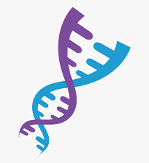

</br>


Code:

```python
from sys import argv
from cs50 import get_string

if len(argv) != 3:
    print('Enter the correct form ')
    exit(1)

dataf = open(argv[1], 'r')
STRs = []
name = {}

for i, row in enumerate(dataf):
    if i == 0:
        STRs = [STR for STR in row.strip().split(',')][1:]
        print(STRs)
    else:
        curr_row = row.strip().split(',')
        name[curr_row[0]] = [int(x) for x in curr_row[1:]]
        print(name[curr_row[0]])
seqr = open(argv[2], 'r').read()
final_STR = []

for STR in STRs:
    i = 0 
    max_STR = -1 
    curr_max = 0
    while i < len(seqr):
        curr_wind = seqr[i: i + len(STR)]
        if curr_wind == STR:
            curr_max += 1
            max_STR = max(max_STR, curr_max)
            i += len(STR)
        else:
            curr_max = 0
            i += 1
    final_STR.append(max_STR)

for names, data in name.items():
    if data == final_STR:
        print(names)
        exit(0)
print('No match')    
```
***

</br>
</br>


In the final, To test this code:

```markdown

$ python dna.py databases/large.csv sequences/5.txt
Lavender

```
</br>



</br>
</br>


<strong>
You can find the txt & csv files  on the github page.
</strong>

</br>

*** 

## Background :

DNA, the carrier of genetic information in living things, has been used in criminal justice for decades. But how, exactly, does DNA profiling work? Given a sequence of DNA, how can forensic investigators identify to whom it belongs?

Well, DNA is really just a sequence of molecules called nucleotides, arranged into a particular shape (a double helix). Every human cell has billions of nucleotides arranged in sequence. Each nucleotide of DNA contains one of four different bases: adenine (A), cytosine (C), guanine (G), or thymine (T). Some portions of this sequence (i.e., genome) are the same, or at least very similar, across almost all humans, but other portions of the sequence have a higher genetic diversity and thus vary more across the population.

One place where DNA tends to have high genetic diversity is in Short Tandem Repeats (STRs). An STR is a short sequence of DNA bases that tends to repeat consecutively numerous times at specific locations inside of a person’s DNA. The number of times any particular STR repeats varies a lot among individuals. In the DNA samples below, for example, Alice has the STR AGAT repeated four times in her DNA, while Bob has the same STR repeated five times.


Using multiple STRs, rather than just one, can improve the accuracy of DNA profiling. If the probability that two people have the same number of repeats for a single STR is 5%, and the analyst looks at 10 different STRs, then the probability that two DNA samples match purely by chance is about 1 in 1 quadrillion (assuming all STRs are independent of each other). So if two DNA samples match in the number of repeats for each of the STRs, the analyst can be pretty confident they came from the same person. CODIS, the FBI’s DNA database, uses 20 different STRs as part of its DNA profiling process.

What might such a DNA database look like? Well, in its simplest form, you could imagine formatting a DNA database as a CSV file, wherein each row corresponds to an individual, and each column corresponds to a particular STR.


```
name,AGAT,AATG,TATC
Alice,28,42,14
Bob,17,22,19
Charlie,36,18,25

```

The data in the above file would suggest that Alice has the sequence AGAT repeated 28 times consecutively somewhere in her DNA, the sequence AATG repeated 42 times, and TATC repeated 14 times. Bob, meanwhile, has those same three STRs repeated 17 times, 22 times, and 19 times, respectively. And Charlie has those same three STRs repeated 36, 18, and 25 times, respectively.

So given a sequence of DNA, how might you identify to whom it belongs? Well, imagine that you looked through the DNA sequence for the longest consecutive sequence of repeated AGATs and found that the longest sequence was 17 repeats long. If you then found that the longest sequence of AATG is 22 repeats long, and the longest sequence of TATC is 19 repeats long, that would provide pretty good evidence that the DNA was Bob’s. Of course, it’s also possible that once you take the counts for each of the STRs, it doesn’t match anyone in your DNA database, in which case you have no match.

In practice, since analysts know on which chromosome and at which location in the DNA an STR will be found, they can localize their search to just a narrow section of DNA. But we’ll ignore that detail for this problem.


Your task is to write a program that will take a sequence of DNA and a CSV file containing STR counts for a list of individuals and then output to whom the DNA (most likely) belongs.


## Specification : 

In a file called `dna.py`, implement a program that identifies to whom a sequence of DNA belongs.

1-The program should require as its first command-line argument the name of a CSV file containing the STR counts for a list of individuals and should require as its second command-line argument the name of a text file containing the DNA sequence to identify.

- If your program is executed with the incorrect number of command-line arguments, your program should print an error message of your choice (with print). If the correct number of arguments are provided, you may assume that the first argument is indeed the filename of a valid CSV file and that the second argument is the filename of a valid text file.


2- 
Your program should open the CSV file and read its contents into memory.

- You may assume that the first row of the CSV file will be the column `names`. The first column will be the word name and the remaining columns will be the STR sequences themselves.


3- 
Your program should open the DNA sequence and read its contents into memory.

4- For each of the STRs (from the first line of the CSV file), your program should compute the longest run of consecutive repeats of the STR in the DNA sequence to identify. Notice that we’ve defined a helper function for you, `longest_match`, which will do just that!

5- If the STR counts match exactly with any of the individuals in the CSV file, your program should print out the name of the matching individual.

- You may assume that the STR counts will not match more than one individual.
- If the STR counts do not match exactly with any of the individuals in the CSV file, your program should print `No match`.




</br>


<strong> 
You’re encouraged to first test your code on your own for each of the following.
</strong>

1- Run your program as python dna.py databases/small.csv sequences/1.txt. 
Your program should output Bob.

2- Run your program as python dna.py databases/small.csv sequences/2.txt. 
Your program should output No match.

3- Run your program as python dna.py databases/small.csv sequences/3.txt. 
Your program should output No match.

4- Run your program as python dna.py databases/small.csv sequences/4.txt. 
Your program should output Alice.

5- Run your program as python dna.py databases/large.csv sequences/5.txt. 
Your program should output Lavender.

6- Run your program as python dna.py databases/large.csv sequences/6.txt. 
Your program should output Luna.

7- Run your program as python dna.py databases/large.csv sequences/7.txt. 
Your program should output Ron.

8- Run your program as python dna.py databases/large.csv sequences/8.txt. 
Your program should output Ginny.

9- Run your program as python dna.py databases/large.csv sequences/9.txt. 
Your program should output Draco.

10- Run your program as python dna.py databases/large.csv sequences/10.txt. 
Your program should output Albus.

11- Run your program as python dna.py databases/large.csv sequences/11.txt. 
Your program should output Hermione.

12- Run your program as python dna.py databases/large.csv sequences/12.txt. 
Your program should output Lily.

13- Run your program as python dna.py databases/large.csv sequences/13.txt. 
Your program should output No match.

14- Run your program as python dna.py databases/large.csv sequences/14.txt. 
Your program should output Severus.

15- Run your program as python dna.py databases/large.csv sequences/15.txt. 
Your program should output Sirius.

16- Run your program as python dna.py databases/large.csv sequences/16.txt. 
Your program should output No match.

17- Run your program as python dna.py databases/large.csv sequences/17.txt. 
Your program should output Harry.

18- Run your program as python dna.py databases/large.csv sequences/18.txt. 
Your program should output No match.

19- Run your program as python dna.py databases/large.csv sequences/19.txt. 
Your program should output Fred.

20- Run your program as python dna.py databases/large.csv sequences/20.txt. 
Your program should output No match.


</br>
</br>
