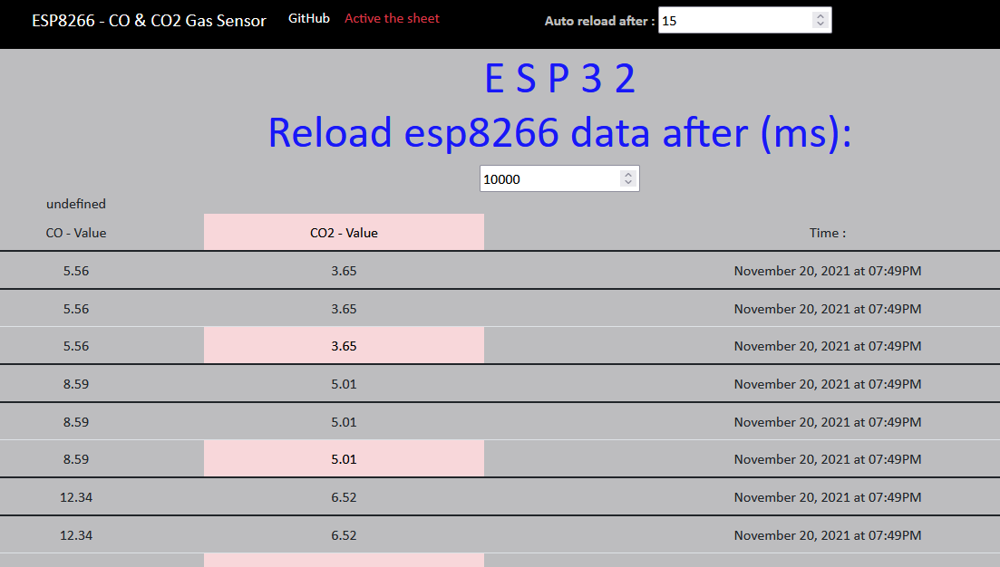

</br>
</br>

Code -C- :

```cpp
/////////////////////////////////
// Generated with a lot of love//
// with TUNIOT FOR ESP8266     //
// Website: Easycoding.tn      //
/////////////////////////////////

////////////////////////////////

//        THIS CODE IS CREATED BY : Omar Jamal AlZant

///////////////////////////////
#include <ESP8266WiFi.h>
#include <WiFiClient.h>
#include <ESP8266WebServer.h>
#include <ESP8266mDNS.h>
//Include the library
#include <MQUnifiedsensor.h>

//Definitions
#define placa "Arduino UNO"
#define Voltage_Resolution 5
#define pin A0 //Analog input 0 of your arduino
#define type "MQ-135" //MQ135
#define ADC_Bit_Resolution 10 // For arduino UNO/MEGA/NANO
#define RatioMQ135CleanAir 3.6//RS / R0 = 3.6 ppm  
#define calibration_button 13 //Pin to calibrate your sensor

//Declare Sensor
MQUnifiedsensor MQ135(placa, Voltage_Resolution, ADC_Bit_Resolution, pin, type);

String  mystring;
String  mystring1;
String  mystring2;

WiFiClient client;

String MakerIFTTT_Key ;
;String MakerIFTTT_Event;

// html /////// setup /////

int delay1 = 30000;                              
const char* html = "<!DOCTYPE html><html lang=\"en\"><head> <meta charset=\"UTF-8\"/> <meta name=\"viewport\" content=\"width=device-width, initial-scale=1, shrink-to-fit=no\"/> <meta http-equiv=\"x-ua-compatible\" content=\"ie=edge\"/> <link href=\"https://cdnjs.cloudflare.com/ajax/libs/bootstrap/5.1.3/css/bootstrap.min.css\" rel=\"stylesheet\"> <script src=\"https://cdnjs.cloudflare.com/ajax/libs/jquery/3.5.1/jquery.min.js\"></script> <script src=\"https://cdnjs.cloudflare.com/ajax/libs/bootstrap/5.1.3/js/bootstrap.min.js\"></script> <script src=\"https://cdnjs.cloudflare.com/ajax/libs/PapaParse/5.3.1/papaparse.min.js\"></script> <title>Level of gas </title> <link rel=\"icon\" href=\"https://drive.google.com/file/d/1cYoW7XnMXOjLJ6tfUT72y90b28rDLGr8/view?usp=sharing\" type=\"image/x-icon\"/> <style>#MainloginArea{margin: auto; height: 400px; width: 500px;}#mainbreak{height: 300px; width: 100%;}body{text-align: center; font-family: \"Calibri\"; background-color: rgba(0, 3, 8, 0.26)}h1{color: rgba(0, 0, 255, 0.87); font-size: 50px;}</style></head><body> <nav class=\"navbar navbar-expand-lg navbar-dark bg-black \"> <div class=\"container-fluid\">  <a class=\"navbar-brand \" style=\"margin-left: 50px;\"> ESP8266 - CO & CO2 Gas Sensor</a> <button class=\"navbar-toggler\" type=\"button\" data-bs-toggle=\"collapse\" data-bs-target=\"#navbarNav\" aria-controls=\"navbarNav\" aria-expanded=\"false\" aria-label=\"Toggle navigation\"> <span class=\"navbar-toggler-icon\"></span> </button> <div class=\"collapse navbar-collapse\" id=\"navbarNav\"> <ul class=\"navbar-nav\"> <li class=\"nav-item\"> <a class=\"nav-link active\" aria-current=\"page\" href=\"https://github.com/omar-alzant/ESP-GasSensor\">GitHub</a> </li><li> <a href=\"https://cors-anywhere.herokuapp.com/corsdemo\" class='nav-link active text-danger' aria-current=\"page\">Active the sheet</a> </li><li style=\"margin-left: 100px;\" class=\"nav-item\"> <a class=\"nav-link disactive\" aria-current=\"page\"> <strong> Auto reload after : <input type=\"number\" id=\"nbr\" oninput=\"refresh();\"></strong></a> </li></ul> </div></div></nav> <h1>E S P 3 2<br>Reload esp8266 data after (ms): </h1> <div> <form action=\"/set\" method=\"GET\"> <input id=\"btn\"  type=\"number\" placeholder=\"Enter nbr\" style=\"width: 177px;\" name=\"nbr\"> </form> </div><table class=\"table table-hover\" id=\"demo\"></table> <script>var url=\"https://docs.google.com/spreadsheets/d/e/2PACX-1vQWX-yP_2T0Cg5Rml3oVMcyTQtY3ts7EwwfweJxq8kSNhQyHS_KN2GqXIwMKsNnW8Oz3WY1cPeyQR-6/pub?output=csv\"; var table=document.querySelector(\"table\"); var ip=\"\"; var xhr=new XMLHttpRequest(); xhr.onreadystatechange=function (){if (xhr.readyState==4 && xhr.status==200){var data=Papa.parse(xhr.responseText); var contents=data.data; for (var i in contents){ip=contents[i][0]; if (contents[i][1] <=40 && contents[i][2] <=20){var row=\"<tr>\"; row +=\"<td>\" + contents[i][1] + \"</td>\"; row +=\"<td>\" + contents[i][2] + \"</td>\"; row +=\"<td>\" + contents[i][3] + \"</td>\"; row +=\"</tr>\"; table.innerHTML +=row;}if (contents[i][1] > 40 && contents[i][2] > 20){var row=\"<tr>\"; row +=\"<td class='table-danger'>\" + contents[i][1] + \"</td>\"; row +=\"<td class='table-danger'>\" + contents[i][2] + \"</td>\"; row +=\"<td>\" + contents[i][3] + \"</td>\"; row +=\"</tr>\"; table.innerHTML +=row;}else{if (contents[i][1] > 40){var row=\"<tr>\"; row +=\"<td class='table-danger'>\" + contents[i][1] + \"</td>\"; row +=\"<td >\" + contents[i][2] + \"</td>\"; row +=\"<td>\" + contents[i][3] + \"</td>\"; row +=\"</tr>\"; table.innerHTML +=row;}else{if (contents[i][2] > 20) var row=\"<tr>\"; row +=\"<td >\" + contents[i][1] + \"</td>\"; row +=\"<td class='table-danger'>\" + contents[i][2] + \"</td>\"; row +=\"<td>\" + contents[i][3] + \"</td>\"; row +=\"</tr>\"; table.innerHTML +=row;}}}}}; xhr.open(\"GET\", \"https://cors-anywhere.herokuapp.com/\" + url, true); xhr.send(); </script>  <script>var nbr=30; if ($(\"#nbr\").val().length !=0 && $(\"#nbr\").val() >=10){ nbr=$(\"#nbr\").val();} window.setInterval('refresh()', nbr * 1000); function refresh(){window.location.reload();};  </script></body></html>";
ESP8266WebServer server(80);

void handleHome() {
  server.send(200, "text/html", html);
 
}

////////////////////////////////////////////////////


/////////  function to append data /////////////
char *append_str(char *here, String s) 
{  
    int i=0; 
    while (*here++ = s[i])
    {i++;};
    return here-1;
}

char *append_ul(char *here, unsigned long u)
{
  char buf[20];
  return append_str(here, ultoa(u, buf, 10));
 }
 
char post_rqst[256];
char *p;
char *content_length_here;
char *json_start;
int compi;


///////////////////////////


void setup()
{
  
mystring = "";
mystring1 = "";
mystring2 = "";


Serial.begin(115200);


  MQ135.setRegressionMethod(1); //_PPM =  a*ratio^b
  MQ135.init(); 
  
    float calcR0 = 0;
      for(int i = 1; i<=10; i ++)
      {
        MQ135.update(); // Update data, the arduino will be read the voltage on the analog pin
        calcR0 += MQ135.calibrate(RatioMQ135CleanAir); 
       }
       
  MQ135.setR0(calcR0/10);

  WiFi.disconnect();
  delay(3000);
  Serial.println("START");

//////// wifi-user & pwd ////////////////
   
  WiFi.begin("Dlink_6AB8","Lacost123");

  while ((!(WiFi.status() == WL_CONNECTED)))
  {
    delay(300);
    Serial.println("");
  }
  
  Serial.println("Connected");
  Serial.println("your IP is:");
  Serial.println((WiFi.localIP().toString()));

///////////// get code (delay - to reload data from esp) from html //////
  
  server.begin();
  Serial.println("HTTP server started");

  server.on("/",[]()
  {
    server.send(200,"text/html", html);
  });
  
  server.on("/set" , []()
  {
        delay1= (server.arg("nbr")).toInt();  
    });  

}


void loop()
{ 
  server.handleClient();

  float calcR0 = 0;
  calcR0 += MQ135.calibrate(RatioMQ135CleanAir);
  MQ135.update(); // Update data, the arduino will be read the voltage on the analog pin

  MQ135.setA(605.18); MQ135.setB(-3.937); // Configurate the ecuation values to get CO concentration
  float CO = MQ135.readSensor(); // Sensor will read PPM concentration using the model and a and b values setted before or in the setup

  MQ135.setA(110.47); MQ135.setB(-2.862); // Configurate the ecuation values to get CO2 concentration
  float CO2 = MQ135.readSensor(); // Sensor will read PPM concentration using the model and a and b values setted before or in the setup

    mystring1 = CO ;
    mystring2 = CO2 ;
    if (client.connect("maker.ifttt.com",80)) {
       if(isinf(calcR0)) mystring = "open circuit";

      MakerIFTTT_Key ="bvOlufPzUDPs4J62Tb--nJ";
      MakerIFTTT_Event ="ESP32";
      p = post_rqst;
      p = append_str(p, "POST /trigger/");
      p = append_str(p, MakerIFTTT_Event);
      p = append_str(p, "/with/key/");
      p = append_str(p, MakerIFTTT_Key);
      p = append_str(p, " HTTP/1.1\r\n");
      p = append_str(p, "Host: maker.ifttt.com\r\n");
      p = append_str(p, "Content-Type: application/json\r\n");
      p = append_str(p, "Content-Length: ");
      content_length_here = p;
      p = append_str(p, "NN\r\n");
      p = append_str(p, "\r\n");
      json_start = p;
      p = append_str(p, "{\"value1\":\"");
  p = append_str(p,mystring);
  //   p = CO;
      p = append_str(p, "\",\"value2\":\"");
  p = append_str(p, mystring1 );   //  stringTwo.concat(millis()); to add variable to string 

    //  p = CO2;
      p = append_str(p, "\",\"value3\":\"");
      p = append_str(p, mystring2);
      p = append_str(p, "\"}");

      compi= strlen(json_start);
      content_length_here[0] = '0' + (compi/10);
      content_length_here[1] = '0' + (compi%10);
      client.print(post_rqst);


      Serial.println("values sent to google sheet");
      
      
    }
          delay(delay1);

}

```

***

# esp-gas-finalproject-CS50
Send the level of gas sensor form esp  to G-sheet &amp; website (or IP) using IFTTT. 


***************************************
                                                  *Step of project*

* 1.Make the electronic circuit:
  * 1.1-Esp8266 NodeMCU. 
  * 1.2-MQ135- CO / CO2 gas sensor-.
  * 1.3-Source of WIFI - Like router || hotspot...
  
* 2.Create a verified Gmail.

* 3.SignUp to (( IFTTT )) from this Gmail.
  * 3.1.After SignUp, create a new applet;
  * 3.2.(If This ) is the esp-wifi- >>> connect to WebHooks.
    * 3.2.1.Set the name you need (event).
  * 3.3.(Then That) is the spreadSheet you want to receive on it.
    * 3.3.1.value1/value2/value3-Occ.. you need to use those JSON variable
          i.g.: value1 = ip of esp // value2 = CO level // value3 = CO2 level
  * 3.4.Check the applet, a new automaticly sheet and file maked?!! ... the code is valid.
  * 3.5.make notice  you want to copy the serial code of your applet (sheet >> setting >> 
         copy *bvOlufPzUDPs4J62Tb--nJ* >>    paste to MakerIFTTT_Key in arduino code ). 
         
* 4.programming a html/css/JS for webSite (i.g.: using VSCode)  
  * 4.1.This web site contain :
    *   4.1.1.Send data from esp to sheet-- IFTTT--. -using arcuino code-
    *   4.1.2.Get the uploaded data in sheet and make it in a table form-. -using XML ajax-
    *   4.1.3.Enter the esp Upload's delay.-using ESPWebServer library for arduino IDE-
    *   4.1.4.Enter the refresh page delay. -using jQuery-$- & window.refresh... -
    *   4.1.5.Change the row's color to red for the under-NormalLevel (Dangerouse) -using the condition #if-
  * 4.2.mini the html code, to put-it into the arduino code. 
  
     
*********************************************
                                                          *Some link*

 * ESP8266 : https://www.instructables.com/NodeMCU-ESP8266-Details-and-Pinout/
 * MQ135 : https://www.waveshare.com/wiki/MQ-135_Gas_Sensor
 * to minimize code :  http://www.tomeko.net/online_tools/cpp_text_escape.php?lang=en  
                      https://www.willpeavy.com/tools/minifier/
 * Program-Ard-IDE: https://www.arduino.cc/en/software
 * ESP library for arduino IDE :  https://randomnerdtutorials.com/how-to-install-esp8266-board-arduino-ide/

                    
********************************************************
                                            Electronic circuit
                                            


                                            MQ135 kind of sensor
                                            
 
                                           
                                            
                                            Result
                                            


***********************************



</br>
</br>


