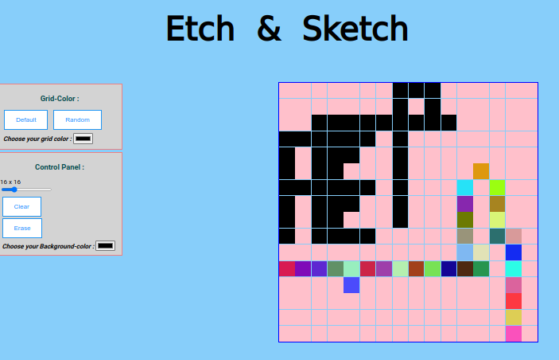

</br>
</br>

We use : 


***

</br>
</br>

The result :



***

</br>
</br>

You can <a href="https://omar-alzant.github.io/Etch-a-Sketch/"> Try it </a>.

</br>
</br>

***

This repo it look like a little place to draw ;

Note: Use the Grid-color then draw .

You can choose your favorite color and background ,

and change the grid size from an input 'range'...

this project is the fourth project in my odin project .

I study some features of JavaScript like :

1- create divs for grid from script .

2- edit styles from script .

3- include function in another.

4- change value and link it to html .

5- Improvement in how to put steps to work.

6- Using addEventListener and appendChild.

7- Using for loop.

8- Using arrow function.

***

</br>
</br>

Code -HTML- :

```html
 <!DOCTYPE html>
<html lang="en">
  <head>
    <meta charset="UTF-8" />
    <meta http-equiv="X-UA-Compatible" content="IE=edge" />
    <meta name="viewport" content="width=device-width, initial-scale=1.0" />
    <link rel="stylesheet" href="css/style.css" />
    <link rel="shortcut icon" href="img/icon1.jpeg">
    <link
    href="https://fonts.googleapis.com/css2?family=Roboto:wght@400;700&display=swap"
    rel="stylesheet"
  />
    <link
    rel="stylesheet"
    href="https://cdnjs.cloudflare.com/ajax/libs/font-awesome/4.7.0/css/font-awesome.min.css"
  />
    <title >Etch-&-Sketch</title>
  </head>

  <header>
    <h1> Etch & Sketch </h1>
  </header>  
  
  <body>

    <div class="container">
      
      <div class="gridCdiv">
        <h3 > Grid-Color : </h3>
        
        <button id="def">Default</button>
        <button id="rand">Random</button>
        <div style="margin: 8px;">
        <label for="gridColor" > <em><strong>Choose your grid color :  </strong></em> </label>
        <input type="color" id="gridColor" name="gridColor" />
      </div>
    </div>

      <div class="control">
        <h3>Control Panel :</h3>
        <div id="showVal"></div>
        <input type="range" name="rangeInput" value="16" id="gridV" min="1" max="64"  onchange="updateTextInput(this.value );">
        <button id="clear"> Clear</button>   
        <button id="erase">Erase</button>   
      <div style="margin: 5px;">  
        <label for="favcolor"> <em><strong> Choose your Background-color :  </strong></em> </label>
        <input type="color" id="favcolor" name="favcolor" />
      </div>
      </div>
    </div>

    <div class="g">
    <div class="wrapper" id="wrapper" ></div>
  </div>

  </body>

  <footer class="footer">
    <p>
      Copyright © 
      <script>
        document.write(new Date().getFullYear())
      </script>
       Omar-Alzant
    </p>
    <a href="https://github.com/omar-alzant" target="_blank">
      <i class="fa fa-github"></i></a>
  </footer>
  
  <script src="js/script.js"></script>
</html>


```

*** 

</br>
</br>

Code -CSS- :

```css
body {
  font-family: "Roboto", sans-serif;
  background-color: lightskyblue;
}

h1 {
  text-align: center;
  font-size: 80px;
  font-family: Robo;
}

h3 {
  text-align: center;
  color: rgb(4, 76, 79);
}

button {
  margin-left: 10px;
  border: 2px solid black;
  background-color: white;
  border-color: #2196F3;
  color: dodgerblue;
  padding: 14px 28px;
  font-size: 16px;
  cursor: pointer;
}

button:hover {
  background: #2196F3;
  color: white;
}
/* ************** GRID Class  ****************** */

#wrapper {
  display: grid;
  grid-gap: 1.5px;
}

#wrapper > div {
  background-color: #ffc0cb;
  padding: 0.5px;
  grid-gap: 1.5px;
}

.g{
  float: right;
  margin-right: 100px;
  margin-bottom: 100px;
  margin-top: auto;
}
/* ************************************************* */

.container {
  float: left;
}
.gridCdiv {

  border: 2px solid lightcoral;
  margin: 5px;
  padding: 5px;
  width: 300px;
  height: auto;
  background-color: lightgray;
}

.control {  
  border: 2px solid lightcoral;
  margin: 5px;
  padding: 5px;
  background-color: lightgray;
  width: 300px;
  height: auto;
}

.control button{
  display: grid;
  margin: 5px;
}
/* 
.grid-item {
  user-select: none;
}
.border-top-left {
    border-top: 1px solid rgb(156, 156, 156);
    border-left: 1px solid rgb(156, 156, 156);
} */  

footer {
  display: flex;
  clear: both;
  align-items: center;
  justify-content: center;
  background-color: lightslategray;
}

```

***

</br>
</br>

Code -JS- :

```javascript

const container = document.querySelector(".container");
const d = document.querySelector('.wrapper');    
const div = document.createElement("div");
const Bdef = document.getElementById("def");
const Brand = document.getElementById("rand");
const Icolor = document.getElementById("gridColor");
const clr = document.getElementById("clear");
const erase = document.getElementById("erase");
const c = document.getElementById("favcolor");
const showVal = document.getElementById("showVal");
const GridVal = document.getElementById("gridV");

// let n =16;

      // **************************************************

      // GridVal.addEventListener("input", () => {
      //   const n = parseInt(GridVal.value);
      //   d.style.gridTemplateColumns = `repeat(${n},auto)`;
      //   d.style.gridTemplateRows = `repeat(${n},auto)`;
      //   container.appendChild(d);
      // });
    

      // **************************************************
      GridVal.onmousemove = (e) => updateSize(e.target.value);
      changeSize(16);

      GridVal.onchange = (e) => changeSize(e.target.value);
      // erase.onclick = () => { div.style.background = `#ffc0cb`; };

// d.style.cssText = `width:${w}px; height:${h}px; border: 5px solid black;`;

// **************************************************

c.addEventListener("input", () => {
  let bcolor = c.value;
  d.style.background = `${bcolor}`;
   container.appendChild(d);
});

// **************************************************

clr.addEventListener("click", () => {
  window.location.reload();
});

// **************************************************

function changeSize(value) {

  d.innerHTML = '';

for (i = 0; i < value; i++) {
  for(j = 0; j < value; j++){
    
  const div = document.createElement("div");
  
  d.style.border = '1px solid blue';
  d.style.width = '650px';
  d.style.height = '650px';
  d.style.gridTemplateColumns = `repeat(${value},auto)`;
  d.style.gridTemplateRows = `repeat(${value},auto)`;

      // **************************************************

      erase.addEventListener("click", () => {
        let bcolor = c.value;
        div.addEventListener("touchmove", () => {
          div.style.background = `#ffc0cb`;
        });
      });
      erase.addEventListener("click", () => {
        let bcolor = c.value;
        div.addEventListener("mouseover", () => {
          div.style.background = `#ffc0cb`;
        });
      });
    
    
          // **************************************************
    
      Icolor.addEventListener("input", () => {
        div.addEventListener("touchmove", () => {
          let gcolor = Icolor.value;
          div.style.cssText = `background-color : ${gcolor};`;
        });
      });
      Icolor.addEventListener("input", () => {
        div.addEventListener("mouseover", () => {
          let gcolor = Icolor.value;
          div.style.cssText = `background-color : ${gcolor};`;
        });
      });
    
          // **************************************************
    
      Bdef.addEventListener("click", () => {
        div.addEventListener("touchmove", () => {
          div.style.cssText = ` background-color : black;`;
        });
      });
    
      Bdef.addEventListener("click", () => {
        div.addEventListener("mouseover", () => {
          div.style.cssText = ` background-color : black;`;
        });
      });
    
          // **************************************************
    
      Brand.addEventListener("click", () => {
        div.addEventListener("mouseover", () => {
          div.style.cssText = ` background-color: ${random_rgba()};`;
        });
      });
    

      Brand.addEventListener("click", () => {
        div.addEventListener("touchmove", () => {
          div.style.cssText = ` background-color: ${random_rgba()};`;
        });
      });
        // **************************************************

      // **************************************************

  d.appendChild(div);
  // container.appendChild(d);
    };
    '<br>'
};

};


// ******************** Functions  ***************************

function updateSize(value){
  showVal.textContent = `${value} x ${value}`;
};

function random_rgba() {
  var o = Math.round,
    r = Math.random,
    s = 255;
  return "rgb(" + o(r() * s) + "," + o(r() * s) + "," + o(r() * s) + ")";
}


function updateTextInput(a) {
  showVal.textContent = `${a} x ${a}`;
  return a;
}


```

***

</br>
</br>
