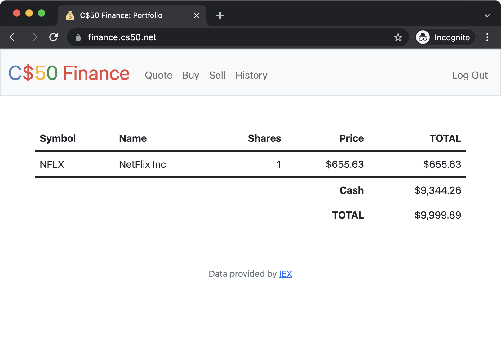

</br>
</br>

In this project, we use the `Flask`, a python web  framework that provide useful tools and features that make creating web app in Python easier...


YOu can fastly view this 
<a href="https://www.digitalocean.com/community/tutorials/how-to-make-a-web-application-using-flask-in-python-3">
Tuterial </a> .

</br>
</br>


***



</br>
</br>

***

Code -Py-:

```python
import os

from cs50 import SQL
from flask import Flask, flash, redirect, render_template, request, session
from flask_session import Session
from tempfile import mkdtemp
from werkzeug.exceptions import default_exceptions, HTTPException, InternalServerError
from werkzeug.security import check_password_hash, generate_password_hash

from helpers import apology, login_required, lookup, usd

# Configure application
app = Flask(__name__)

# Ensure templates are auto-reloaded
app.config["TEMPLATES_AUTO_RELOAD"] = True


# Ensure responses aren't cached
@app.after_request
def after_request(response):
    response.headers["Cache-Control"] = "no-cache, no-store, must-revalidate"
    response.headers["Expires"] = 0
    response.headers["Pragma"] = "no-cache"
    return response


# Custom filter
app.jinja_env.filters["usd"] = usd

# Configure session to use filesystem (instead of signed cookies)
app.config["SESSION_FILE_DIR"] = mkdtemp()
app.config["SESSION_PERMANENT"] = False
app.config["SESSION_TYPE"] = "filesystem"
Session(app)

# Configure CS50 Library to use SQLite database
db = SQL("sqlite:///finance.db")

# Make sure API key is set
if not os.environ.get("API_KEY"):
    raise RuntimeError("API_KEY not set")


@app.route("/")
@login_required
def index():
    """Show portfolio of stocks"""
    return apology("TODO")


@app.route("/buy", methods=["GET", "POST"])
@login_required
def buy():
    """Buy shares of stock"""
    return apology("TODO")


@app.route("/history")
@login_required
def history():
    """Show history of transactions"""
    return apology("TODO")


@app.route("/login", methods=["GET", "POST"])
def login():
    """Log user in"""

    # Forget any user_id
    session.clear()

    # User reached route via POST (as by submitting a form via POST)
    if request.method == "POST":

        # Ensure username was submitted
        if not request.form.get("username"):
            return apology("must provide username", 403)

        # Ensure password was submitted
        elif not request.form.get("password"):
            return apology("must provide password", 403)

        # Query database for username
        rows = db.execute("SELECT * FROM users WHERE username = ?", request.form.get("username"))

        # Ensure username exists and password is correct
        if len(rows) != 1 or not check_password_hash(rows[0]["hash"], request.form.get("password")):
            return apology("invalid username and/or password", 403)

        # Remember which user has logged in
        session["user_id"] = rows[0]["id"]

        # Redirect user to home page
        return redirect("/")

    # User reached route via GET (as by clicking a link or via redirect)
    else:
        return render_template("login.html")


@app.route("/logout")
def logout():
    """Log user out"""

    # Forget any user_id
    session.clear()

    # Redirect user to login form
    return redirect("/")


@app.route("/quote", methods=["GET", "POST"])
@login_required
def quote():
    """Get stock quote."""
    return apology("TODO")


@app.route("/register", methods=["GET", "POST"])
def register():
    """Register user"""
    return apology("TODO")


@app.route("/sell", methods=["GET", "POST"])
@login_required
def sell():
    """Sell shares of stock"""
    return apology("TODO")


def errorhandler(e):
    """Handle error"""
    if not isinstance(e, HTTPException):
        e = InternalServerError()
    return apology(e.name, e.code)


# Listen for errors
for code in default_exceptions:
    app.errorhandler(code)(errorhandler)

```

***

</br>
</br>

## Background :

If you’re not quite sure what it means to buy and sell stocks (i.e., shares of a company), head
 <a href="https://www.investopedia.com/articles/basics/06/invest1000.asp">
    here 
 </a>  for a tutorial.

You’re about to implement C$50 Finance, a web app via which you can manage portfolios of stocks. Not only will this tool allow you to check real stocks’ actual prices and portfolios’ values, it will also let you buy (okay, “buy”) and sell (okay, “sell”) stocks by querying 
<a href="https://iextrading.com/developer/">
    IEX 
</a>
for stocks’ prices.

Indeed, IEX lets you download stock quotes via their API (application programming interface) using URLs like `https://cloud-sse.iexapis.com/stable/stock/nflx/quote?token=API_KEY`. Notice how Netflix’s symbol (NFLX) is embedded in this URL; that’s how IEX knows whose data to return. That link won’t actually return any data because IEX requires you to use an API key (more about that in a bit), but if it did, you’d see a response in JSON (JavaScript Object Notation) format like this:


```markdown
{
  "avgTotalVolume": 4329597,
  "calculationPrice": "tops",
  "change": 1.21,
  "changePercent": 0.00186,
  "closeSource": "official",
  "companyName": "NetFlix Inc",
  "currency": "USD",
  "iexAskPrice": 662.59,
  "iexAskSize": 8080,
  "iexBidPrice": 652.65,
  "iexBidSize": 102,
  "iexClose": 652.66,
  "iexCloseTime": 1636479523133,
  "iexLastUpdated": 1636479523133,
  "iexMarketPercent": 0.03419734093274243,
  "iexOpen": 652.66,
  "iexOpenTime": 1636479523133,
  "iexRealtimePrice": 652.66,
  "iexRealtimeSize": 30,
  "iexVolume": 43968,
  "lastTradeTime": 1636479523133,
  "latestPrice": 652.66,
  "latestSource": "IEX real time price",
  "latestTime": "12:38:43 PM",
  "latestUpdate": 1636479523133,
  "marketCap": 288341929921,
  "openSource": "official",
  "peRatio": 58.85,
  "previousClose": 651.45,
  "previousVolume": 2887523,
  "primaryExchange": "NASDAQ",
  "symbol": "NFLX",
  "week52High": 690.97,
  "week52Low": 463.41,
  "ytdChange": 0.2066202315388457
}
```
Notice how, between the curly braces, there’s a comma-separated list of key-value pairs, with a colon separating each key from its value.

***

</br>
</br>

## Running :

1- Understanding :

- `app.py`

Open up app.py. Atop the file are a bunch of imports, among them CS50’s SQL module and a few helper functions. More on those soon.

After configuring 
<a href="http://flask.pocoo.org/">
    Flask 
</a>
, notice how this file disables caching of responses (provided you’re in debugging mode, which you are by default in your code50 codespace), lest you make a change to some file but your browser not notice. Notice next how it configures
<a href="http://jinja.pocoo.org/">
    Jinja
</a>
  with a custom “filter,” usd, a function (defined in helpers.py) that will make it easier to format values as US dollars (USD). It then further configures Flask to store 
  <a href="https://flask.palletsprojects.com/en/1.1.x/quickstart/#sessions">
    sessions 
  </a>
  on the local filesystem (i.e., disk) as opposed to storing them inside of (digitally signed) cookies, which is Flask’s default. The file then configures CS50’s SQL module to use finance.db.

Thereafter are a whole bunch of routes, only two of which are fully implemented: login and logout. Read through the implementation of login first. Notice how it uses db.execute (from CS50’s library) to query finance.db. And notice how it uses check_password_hash to compare hashes of users’ passwords. Finally, notice how login “remembers” that a user is logged in by storing his or her user_id, an INTEGER, in session. That way, any of this file’s routes can check which user, if any, is logged in. Meanwhile, notice how logout simply clears session, effectively logging a user out.

Notice how most routes are “decorated” with @login_required (a function defined in helpers.py too). That decorator ensures that, if a user tries to visit any of those routes, he or she will first be redirected to login so as to log in.

Notice too how most routes support GET and POST. Even so, most of them (for now!) simply return an “apology,” since they’re not yet implemented.

- `helpers.py` 

Next take a look at helpers.py. Ah, there’s the implementation of apology. Notice how it ultimately renders a template, apology.html. It also happens to define within itself another function, escape, that it simply uses to replace special characters in apologies. By defining escape inside of apology, we’ve scoped the former to the latter alone; no other functions will be able (or need) to call it.

Next in the file is login_required. No worries if this one’s a bit cryptic, but if you’ve ever wondered how a function can return another function, here’s an example!

Thereafter is lookup, a function that, given a symbol (e.g., NFLX), returns a stock quote for a company in the form of a dict with three keys: name, whose value is a str, the name of the company; price, whose value is a float; and symbol, whose value is a str, a canonicalized (uppercase) version of a stock’s symbol, irrespective of how that symbol was capitalized when passed into lookup.

Last in the file is usd, a short function that simply formats a float as USD (e.g., 1234.56 is formatted as $1,234.56).

- `requirements.txt`

Next take a quick look at requirements.txt. That file simply prescribes the packages on which this app will depend.

- `static/`

Glance too at static/, inside of which is styles.css. That’s where some initial CSS lives. You’re welcome to alter it as you see fit.

- `templates/`

Now look in templates/. In login.html is, essentially, just an HTML form, stylized with 
<a href="http://getbootstrap.com/">
    Bootstrap
</a>
. In apology.html, meanwhile, is a template for an apology. Recall that apology in helpers.py took two arguments: message, which was passed to render_template as the value of bottom, and, optionally, code, which was passed to render_template as the value of top. Notice in apology.html how those values are ultimately used! And 
<a href="https://github.com/jacebrowning/memegen">
    here’s why 
</a>
0:-)

Last up is layout.html. It’s a bit bigger than usual, but that’s mostly because it comes with a fancy, mobile-friendly “navbar” (navigation bar), also based on Bootstrap. Notice how it defines a block, main, inside of which templates (including apology.html and login.html) shall go. It also includes support for
<a href="https://flask.palletsprojects.com/en/1.1.x/quickstart/#message-flashing">
 Flask’s message
 </a>
  flashing so that you can relay messages 

from one route to another for the user to see.

***

</br>
</br>

## Specification :

1- `register` 

Complete the implementation of register in such a way that it allows a user to register for an account via a form.

- Require that a user input a username, implemented as a text field whose name is username. Render an apology if the user’s input is blank or the username already exists.

- Require that a user input a password, implemented as a text field whose name is password, and then that same password again, implemented as a text field whose name is confirmation. Render an apology if either input is blank or the passwords do not match.

- Submit the user’s input via POST to /register.

- `INSERT` the new user into users, storing a hash of the user’s password, not the password itself. Hash the user’s password with generate_password_hash Odds are you’ll want to create a new template (e.g., register.html) that’s quite similar to login.html.


Once you’ve implemented register correctly, you should be able to register for an account and log in (since login and logout already work)! And you should be able to see your rows via phpLiteAdmin or sqlite3.
 
2-  `quote` 

Complete the implementation of quote in such a way that it allows a user to look up a stock’s current price.

- Require that a user input a stock’s symbol, implemented as a text field whose name is symbol.

- Submit the user’s input via POST to /quote.

- Odds are you’ll want to create two new templates (e.g., quote.html and quoted.html). When a user visits /quote via GET, render one of those templates, inside of which should be an HTML form that submits to /quote via POST. In response to a POST, quote can render that second template, embedding within it one or more values from lookup.

3- `buy` 

Complete the implementation of buy in such a way that it enables a user to buy stocks.

- Require that a user input a stock’s symbol, implemented as a text field whose name is symbol. Render an apology if the input is blank or the symbol does not exist (as per the return value of lookup).

- Require that a user input a number of shares, implemented as a field whose name is shares. Render an apology if the input is not a positive integer.

- Submit the user’s input via POST to /buy.
Odds are you’ll want to call lookup to look up a stock’s current price.

- Odds are you’ll want to SELECT how much cash the user currently has in users.

- Add one or more new tables to finance.db via which to keep track of the purchase. Store enough information so that you know who bought what at what price and when.

> Use appropriate SQLite types.

> Define UNIQUE indexes on any fields that should be unique.

> Define (non-UNIQUE) indexes on any fields via which you will search (as via SELECT with WHERE).

- Render an apology, without completing a purchase, if the user cannot afford the number of shares at the current price.

- You don’t need to worry about race conditions (or use transactions).


Once you’ve implemented buy correctly, you should be able to see users’ purchases in your new table(s) via phpLiteAdmin or sqlite3.

4- `index`

Complete the implementation of index in such a way that it displays an HTML table summarizing, for the user currently logged in, which stocks the user owns, the numbers of shares owned, the current price of each stock, and the total value of each holding (i.e., shares times price). Also display the user’s current cash balance along with a grand total (i.e., stocks’ total value plus cash).


- Odds are you’ll want to execute multiple SELECTs. Depending on how you implement your table(s), you might find GROUP BY HAVING SUM and/or WHERE of interest.

- Odds are you’ll want to call lookup for each stock.

5- `sell`

Complete the implementation of sell in such a way that it enables a user to sell shares of a stock (that he or she owns).

- Require that a user input a stock’s symbol, implemented as a select menu whose name is symbol. Render an apology if the user fails to select a stock or if (somehow, once submitted) the user does not own any shares of that stock.

- Require that a user input a number of shares, implemented as a field whose name is shares. Render an apology if the input is not a positive integer or if the user does not own that many shares of the stock.

- Submit the user’s input via POST to /sell.

- You don’t need to worry about race conditions (or use transactions).


6- `history`

Complete the implementation of history in such a way that it displays an HTML table summarizing all of a user’s transactions ever, listing row by row each and every buy and every sell.

- For each row, make clear whether a stock was bought or sold and include the stock’s symbol, the (purchase or sale) price, the number of shares bought or sold, and the date and time at which the transaction occurred.

- You might need to alter the table you created for buy or supplement it with an additional table. Try to minimize redundancies.

7- `personal touch`

Implement at least one personal touch of your choice:

- Allow users to change their passwords.

- Allow users to add additional cash to their account.
 
- Allow users to buy more shares or sell shares of stocks they already own via index itself, without having to type stocks’ symbols manually.

- Require users’ passwords to have some number of letters, numbers, and/or symbols.

- Implement some other feature of comparable scope.

***


</br>
</br>



</br>
</br>


