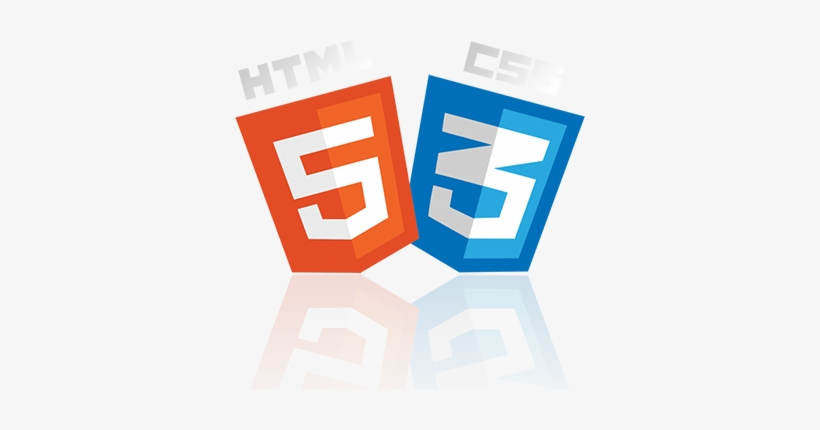
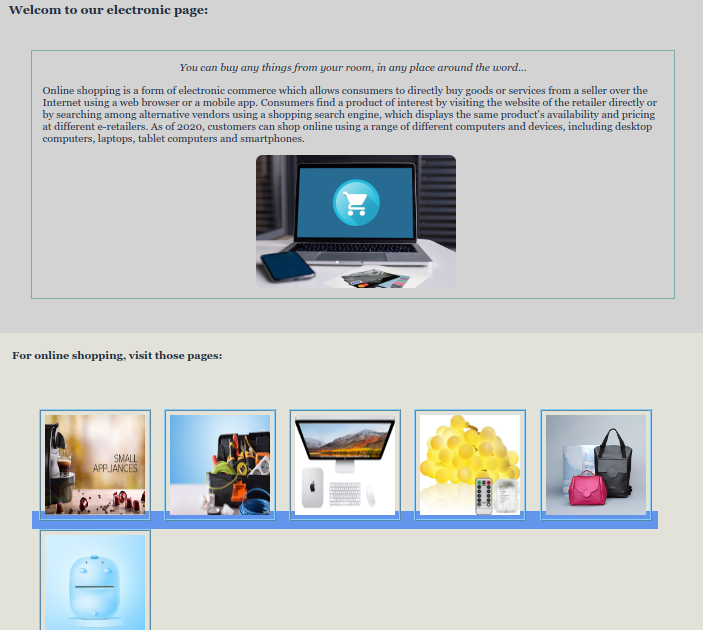

</br>
</br>

We use : 



***

</br>
</br>

The result :



***

</br>
</br>

You can <a href="https://omar-alzant.github.io/Landing-page/"> Try it </a>.

</br>
</br>

***

Code -HTML- :

```html
 
<!DOCTYPE html>
<html lang="en">
  <head>
    <meta charset="UTF-8" />
    <meta http-equiv="X-UA-Compatible" content="IE=edge" />
    <meta name="viewport" content="width=device-width, initial-scale=1.0" />
    <link rel="icon" href="img/shop2.jpg">
    <link rel="stylesheet" href="css/style.css" />
    <link rel="stylesheet" href="https://cdnjs.cloudflare.com/ajax/libs/font-awesome/4.7.0/css/font-awesome.min.css"/>
    <title>ElectronicShopping</title>
  </head>
  <body>
    <header>
  
        <nav class=" navbar">
            <div class="header-logo">
                
            </div>
            <div class="header-link">
                <a href="#">About</a>
                <a href="#">Shop</a>
                <a href="other page/contact.html">Contact</a>                    
            </div>
        </nav>

      <h3 style="margin-bottom: 50px; margin-left: 20px;">Welcom to our electronic page:<br /></h3>

      <div class="header">
        <em>
          You can buy any things from your room, in any place around the word...
        </em>
        <p>
          Online shopping is a form of electronic commerce which allows
          consumers to directly buy goods or services from a seller over the
          Internet using a web browser or a mobile app. Consumers find a product
          of interest by visiting the website of the retailer directly or by
          searching among alternative vendors using a shopping search engine,
          which displays the same product's availability and pricing at
          different e-retailers. As of 2020, customers can shop online using a
          range of different computers and devices, including desktop computers,
          laptops, tablet computers and smartphones.
        </p>
        
      </div>
    </header>

    <div style="background-color: rgb(226, 226, 217); padding: 25px">
      <strong>For online shopping, visit those pages:</strong>
      <br />
      <br />
      <br />

      <div class="body">
        <div class="box"><a href="https://www.espressocoffeeshop.com/en/" > </a></div>
        <div class="box"><a href="https://www.circuitspecialists.com/hand-tools-for-electronics"> </a></div>
        <div class="box"><a href="https://www.apple.com/shop/buy-mac"> </a></div>
        <div class="box"><a href="https://www.hicart.com/home-kitchen/home-deco/lighting"> </a></div>
        <div class="box"><a href="https://awamaki.org/product-category/wovens/?gclid=EAIaIQobChMIpNGT8ITx9AIVc2HmCh0_9gonEAMYASAAEgK6lvD_BwE"></a></div>
        <div class="box"><a href="https://www.amazon.com/s?k=bluetooth+printer&ref=nb_sb_noss_2"></a></div>
      </div>

      <div style="margin-left: 35px">
        <p>To Sign-in <a href="#"> Sign-in</a></p>
      </div>
    </div>

    <footer>
      <div class="footer">
        <h5>
          <i class="fa fa-copyright"></i>
          Created By Omar Jamal Alzant 2021
        </h5>
      </div>
    </footer>
  </body>
</html>

```

*** 

</br>
</br>

Code -CSS- :

```css
/* @media (max-width:800px) {
  body {
    background-color: black;
    font-family: Georgia, "Times New Roman", Times, serif;
    font-size: medium;
    color: rgb(27, 45, 63);
    display: flex;
    flex-direction: column;
  } */

body {
  background-color: lightgray;
  font-family: Georgia, "Times New Roman", Times, serif;
  font-size: medium;
  color: rgb(27, 45, 63);
  display: flex;
  flex-direction: column;
}

.navbar {
    display: flex;
    color: #F9FAF8;
    background-color: #1F2937;
    padding: 20px 0px 20px 25px;
    align-items: center;
}

.header-link {
    display: flex;
    margin-left: auto;
    padding: 0px 50px 0px 0px;  
}

.header-link a {
    text-decoration: none;
    color: #E5E7EB;
    font-size: 18px;
    padding: 10px;
    font-family: 'Roboto', arial;
}
.header-logo img {

    width: 50px;
    height: 50px;
    margin-right: auto;
}


.header {
display: flex;
  border: 2px solid rgb(124, 172, 172);
  padding: 15px;
  width: auto;
  margin-left: 5%;
  margin-right: 5%;
  margin-bottom: 50px;
  align-items: center;
  justify-content: center;
  flex-flow: column wrap;
}


header img {
  justify-content: center;
  border-radius: 10px;
  margin-left: 10px;
  width: 300px;
  height: 200px;
}

.body {
  display: flex;
  flex-direction: row;
  flex-wrap: wrap;
  padding: 30px;
}

.box  img{
  border: 4px ridge lightskyblue;
  padding: 5px;
  width: 150px;
  height: 150px;
  margin: 5px;
}

.box a{
    background-color: cornflowerblue;
    
}


.button {
  margin-top: 25px;
  background: lightskyblue;
  border: none;
  padding: 5px;
}

a:focus,
a:hover {
  color: black;
  font-size: larger;
}
a {
  padding: 5px;
  color: lightyellow;
  list-style-type: none;
  text-decoration: none;
  background-color: lightseagreen;
}
footer {
  display: flex;
  align-items: center;
  justify-content: center;
}

```

***

</br>
</br>

