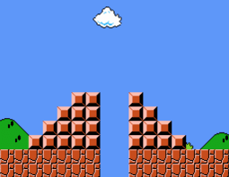

</br>

Code:

```python
from cs50 import get_int


def get_post_int():

    while True:
        nbr = get_int("Height: ")
        if nbr > 0 and nbr < 9:
            break
    return nbr


nbr = get_post_int()

for i in range(1, nbr+1):
    print(' ' * (nbr - i) + '#' * i + ' ' * 2 + '#' * i)
```

</br>
</br>


In the final, To test this code:

```markdown
$ ./mario
Height: 4
   #  #
  ##  ##
 ###  ###
####  ####
```

</br>
</br>




</br>
</br>


