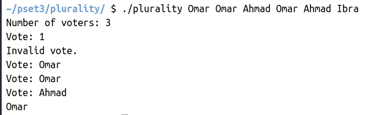

</br>
</br>

Code -C- :

```c
#include <cs50.h>
#include <stdio.h>
#include <string.h>


// Max number of candidates
#define MAX 9

// Candidates have name and vote count
typedef struct
{
    string name;
    int votes;
}
candidate;

// Array of candidates
candidate candidates[MAX];

// Number of candidates
int candidate_count;

// Function prototypes
bool vote(string name);
void print_winner(void);

int main(int argc, string argv[] )
{


    // Check for invalid usage
    if (argc < 2)
    {
        printf("Usage: plurality [candidate ...]\n");
        return 1;
    }

    // Populate array of candidates
    candidate_count = argc - 1;

    if (candidate_count > MAX)
    {
        printf("Maximum number of candidates is %i\n", MAX);
        return 2;
    }

    for (int i = 0; i < candidate_count; i++)
    {
        candidates[i].name = argv[i + 1];
        candidates[i].votes = 0;
    }

    int voter_count = get_int("Number of voters: ");


    // Loop over all voters
    for (int i = 0; i < voter_count; i++)
    {

        bool a;
       do {
         string name = get_string("Vote: ");
          a = vote(name);

        // Check for invalid vote
        if (!vote(name))
        {
            printf("Invalid vote.\n");
        }
          }while(a == 0);
    }
    // Display winner of election
    print_winner();
}

// Update vote totals given a new vote

bool vote(string name)
{

   for (int i = 0; i < candidate_count ; i++)
    {
        if(strcmp(name,candidates[i].name) == 0)
        {
                candidates[i].votes++;
                return true;
        }
    }
   return false;
}


// Print the winner (or winners) of the election

void print_winner(void)
{
    int avr = 0;
    int i = 0;

    while(i  < candidate_count)
    {
        if(avr < candidates[i].votes)
        {
            avr = candidates[i].votes;
        }
        i++;
    }

    for (i = 0 ; i  < candidate_count ; i++)
    {
        if( candidates[i].votes == avr && avr !=0)
        {
            printf("The winner is: %s \n",candidates[i].name);
        }
    }
    return;
}

```
</br>

***

The result : 



***

## Background :

1- Elections come in all shapes and sizes. In the UK, the Prime Minister is officially appointed by the monarch, who generally chooses the leader of the political party that wins the most seats in the House of Commons. The United States uses a multi-step Electoral College process where citizens vote on how each state should allocate Electors who then elect the President.

2- Perhaps the simplest way to hold an election, though, is via a method commonly known as the “plurality vote” (also known as “first-past-the-post” or “winner take all”). In the plurality vote, every voter gets to vote for one candidate. At the end of the election, whichever candidate has the greatest number of votes is declared the winner of the election.

***

</br>
</br>



***

</br>
</br>

## Understanding :

- Let’s take a look at plurality.c and read through the distribution code that’s been provided to you.

- The line #define MAX 9 is some syntax used here to mean that MAX is a constant (equal to 9) that can be used throughout the program. Here, it represents the maximum number of candidates an election can have.

- The file then defines a struct called a candidate. Each candidate has two fields: a string called name representing the candidate’s name, and an int called votes representing the number of votes the candidate has. Next, the file defines a global array of candidates, where each element is itself a candidate.

- Now, take a look at the main function itself. See if you can find where the program sets a global variable candidate_count representing the number of candidates in the election, copies command-line arguments into the array candidates, and asks the user to type in the number of voters. Then, the program lets every voter type in a vote (see how?), calling the vote function on each candidate voted for. Finally, main makes a call to the print_winner function to print out the winner (or winners) of the election.

- If you look further down in the file, though, you’ll notice that the vote and print_winner functions have been left blank. This part is up to you to complete!


***

</br>
</br>


## Specification :

Complete the implementation of `plurality.c` in such a way that the program simulates a plurality vote election.

1- Complete the vote function.

- vote takes a single argument, a string called name, representing the name of the candidate who was voted for.

- If name matches one of the names of the candidates in the election, then update that candidate’s vote total to account for the new vote.

- The vote function in this case should return true to indicate a successful ballot.

- If name does not match the name of any of the candidates in the election, no vote totals should change, and the vote function should return false to indicate an invalid ballot.

- You may assume that no two candidates will have the same name.

2- Complete the print_winner function.

- The function should print out the name of the candidate who received the most votes in the election, and then print a newline.

- It is possible that the election could end in a tie if multiple candidates each have the maximum number of votes. In that case, you should output the names of each of the winning candidates, each on a separate line.


You should not modify anything else in plurality.c other than the implementations of the vote and print_winner functions (and the inclusion of additional header files, if you’d like).


***


</br>
</br>
