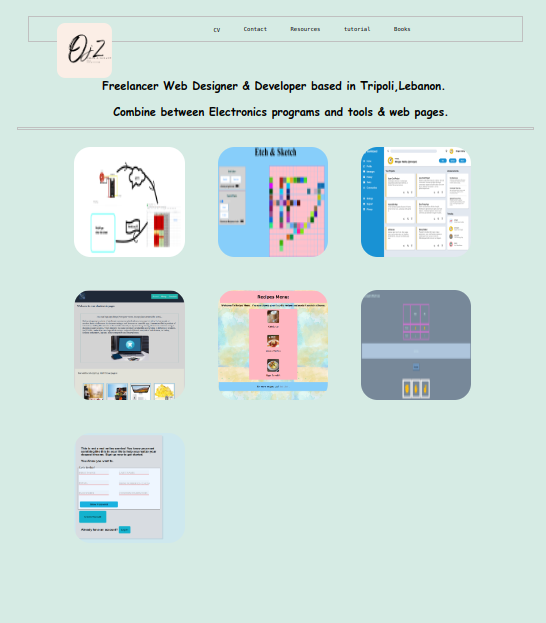

</br>
</br>

We use : 

 


</br>
</br>

You can <a href="https://omar-alzant.github.io/My-portfolio/">Try it </a>.

***

The result : 



***

</br>
</br>

## Steps :

1- Set up and planning :

- Set up your HTML and CSS files with some simple dummy content, just to make sure you have everything linked correctly.

- Set up your git repository (refer to past projects if you need a refresher).

- Download a full-resolution copy of the design files (
  <a href="https://cdn.statically.io/gh/TheOdinProject/curriculum/1c8b5c739efd263e8cc48703988b18d6e3afe034/advanced_html_css/responsive-design/project_personal_portfolio/imgs/portfolio.png">
    desktop
  </a>,
  <a href="https://cdn.statically.io/gh/TheOdinProject/curriculum/1c8b5c739efd263e8cc48703988b18d6e3afe034/advanced_html_css/responsive-design/project_personal_portfolio/imgs/portfolio%20tablet.png">
   tablet
   </a>,
  <a href="https://cdn.statically.io/gh/TheOdinProject/curriculum/1c8b5c739efd263e8cc48703988b18d6e3afe034/advanced_html_css/responsive-design/project_personal_portfolio/imgs/portfolio%20mobile.png">
    mobile
    </a>
    ), and get a general idea for how you’re going to need to lay things out in your HTML document.

2- Gather Assets : 

- The portraits we’ve used in the design files are stock photos downloaded from 
<a href="https://www.pexels.com/">
pexels.com
</a>
. If you don’t have a picture of yourself handy, feel free to go grab a placeholder for now.

- Select your fonts! We’re using `Playfair Display` and `Roboto` in the design, both available with Google fonts.

- In the design we have icon-links for GitHub, LinkedIn and Twitter. Obviously feel free to add whatever links you want to your own site. We got those icons from https://devicon.dev/.

- Other icons (phone, email and external link) were downloaded as SVGs from https://materialdesignicons.com/.


3- Some tips :

- As you might expect, you can organize your work on this project however you please. We’ve given you many tips over the past several lessons, and you are likely already comfortable starting from a blank page.

- If you like being told what to do: The author of this lesson feels most comfortable starting out with the larger sections of the layout, and then working from the top of the page to the bottom. In other words, get the various sections in more or less the right place (header, projects, contact etc.) while ignoring a lot of specific style and content details, then go back through from the top-to-bottom filling-in, styling and cleaning up everything.
- It doesn’t matter when or how you accomplish the responsiveness of this project. There are people who will tell you that you should always start with the mobile experience and then use media-queries to tell your layout how to expand. The ‘mobile-first’ crew does have some good points (Google it!) but in the end, how you accomplish it doesn’t matter as long as it works. Good luck!
- When you’re done, don’t forget to push it to GitHub, and use GitHub Pages to publish it to the world! You should be proud of what you’ve accomplished here!


Code -HTML- :

```html

<!DOCTYPE html>
<html lang="en">
<head>
    <meta charset="UTF-8">
    <meta http-equiv="X-UA-Compatible" content="IE=edge">
    <meta name="viewport" content="width=device-width, initial-scale=1.0 ">
    <link rel="icon" href="./project-image/my—logo—.png">
    <link rel="stylesheet" href="css/style.css">
    <title>Portfolio</title>
</head>
<body>
      <header>
        
        <div class="nav">
           <a href="https://omar-alzant.github.io/myCV/"> <button>CV</button></a>
            <button>Contact </button>
            <button>Resources</button>
            <button> tutorial</button>
            <button> Books  </button>
        </div>
        
      </header>  

      <div class="title">
        <h2> Freelancer Web Designer & Developer based in Tripoli,Lebanon. </h2>
        <h2 style="margin-left: 2vw;">  Combine between Electronics programs and tools & web pages.</h2>
      </div>

<div class="line"></div>

      <div class="grid-cont">
        <div class="grid-item">
          
          <div class="back">
              <p> Espic-transfer data- </p>
              <a href="https://github.com/omar-alzant/esp-gas-finalproject-CS50"> <button> View Code </button> </a>
          </div>
        </div>
        <div class="grid-item">  
          
          <div class="back">
            <p> Etch-&-Sketch </p>
            <a href="https://github.com/omar-alzant/Etch-a-Sketch"> <button> View Code </button> </a>
            <a href="https://omar-alzant.github.io/Etch-a-Sketch/"> <button>Live view</button></a>
          </div>
        </div>
        <div class="grid-item">
          
          <div class="back">
            <p> Admin Dashboard </p>
            <a href="https://github.com/omar-alzant/Admin-Dashboard/"> <button> View Code </button> </a>
            <a href="https://omar-alzant.github.io/Admin-Dashboard/"><button>Live view</button></a>
          </div>
        </div>
        <div class="grid-item">
          
          <div class="back">
            <p> Online Shopping </p>
            <a href="https://github.com/omar-alzant/Landing-page/"> <button> View Code </button> </a>
            <a href="https://omar-alzant.github.io/Landing-page/"><button>Live view</button></a>
          </div>
        </div>
        <div class="grid-item">
          
          <div class="back">
            <p> Recipes </p>
            <a href="https://github.com/omar-alzant/odin-recipes/"> <button> View Code </button> </a>
            <a href="https://omar-alzant.github.io/odin-recipes/"><button>Live view</button></a>
          </div>
        </div>
        <div class="grid-item">
          
          <div class="back">
            <p> Rock-Paper-Scissors </p>
            <a href="https://github.com/omar-alzant/ROCK-PAPER-SCISSORS/"> <button> View Code </button> </a>
            <a href="https://omar-alzant.github.io/ROCK-PAPER-SCISSORS/"><button>Live view</button></a>
          </div>
        </div>
        <div class="grid-item">
          
          <div class="back">
            <p> Espic-transfer data- </p>
            <a href="https://github.com/omar-alzant/Sign-Up-Form/"> <button> View Code </button> </a>
            <a href="https://omar-alzant.github.io/Sign-Up-Form/"><button>Live view</button></a>
          </div>
        </div>
       
        <div class="grid-item">
          <video src="./gif/Peek 2022-03-07 17-09.mp4" alt="Readability">
          <div class="back">
            <p> Readability </p>
            <a href="https://github.com/omar-alzant/Sign-Up-Form/"> <button> View Code </button> </a>
            <a href="https://omar-alzant.github.io/Sign-Up-Form/"><button>Live view</button></a>
          </div>
        </div>
      </div>

      <footer>

      </footer>


    <script src="js/script.js"></script>
</body>
</html>

```
***

</br>
</br>


Code -CSS- :

```css
*,
*::after,
*::before{
    margin: 0;
    padding: 0;
}
/* @import url('https://fonts.googleapis.com/css2?family=Roboto+Mono:wght@100&display=swap'); */
/* @import url('https://fonts.googleapis.com/css2?family=Roboto+Mono:wght@100&family=Sansita+Swashed:wght@300&display=swap'); */

:root{
    --bck: rgb(214, 235, 228);
    --gridwidth:    20vw ;
}


body{
    background-color: var(--bck) ;
    display: grid;
}

.title{
    margin: 3vw;
    padding: 1.5vw;
    display: flexbox;
    justify-self: center;
    font-family: 'Sansita Swashed', cursive;
    margin-bottom:0 ;
}
h2{
    font-size: 2vw;
    margin-top: 2vw;
}

.line{
    border: 2px solid silver;
    margin-left: 3vw;
    margin-right: 3vw;
    margin-top: 0;
}
header{
    display: grid;
    gap: 5vw;
    grid-template-columns: auto 45% auto;
    margin-top: 3vw;
    border:   2px solid silver;
    margin-left: 5vw;
    margin-right: 5vw;
}

img[alt*='logo']{
    position: relative;
    margin-bottom: -7vw;
    margin-top:  1vw ;
    width: 10vw;
    height: 10vw;
    border-radius: 15%;
    float: left;
    margin-left: 5vw;
}

.nav{
    display: flex;
    flex-direction: row;
    align-self: center;
    justify-self: center;
    max-height: 13vh;
}

button{
    padding: 1vw;   
    cursor: pointer;
    margin: 2px;
    border: none; 
    background-color: transparent;
    font-family: 'Roboto Mono', monospace;
    margin-right: 2vw ;
    font-size: 1vw;
}

button:hover{
    border-bottom: 2px solid lightcoral;
}

.grid-cont{
    display: grid;
    grid-template-columns: repeat(3,25vw);
    grid-template-rows: repeat(3,25vw);
    gap: 1vw;  
    margin-left: 3vw;
    margin-right: 3vw;
    margin-top: 1vw;
    justify-content: center;
}

.grid-item{
    /* border: 2px solid orange; */
    margin: 2vw;
}

.back{
    background-color: rgb(151, 234, 237);
    width: var(--gridwidth);
    height: var(--gridwidth);
    border-radius: 15%;
    opacity: 0;
    display: flex;
    flex-direction: column;
    text-align: center;
    justify-content: center;
    align-items: center;
    position: relative;
    transition: opacity 0.7s ease;
}

.back p{
    font-size: 1.5vw;
}

.back:hover{
    opacity: 0.9;
}

img{
    width: var(--gridwidth);
    height: var(--gridwidth);
    border-radius: 15%;
    cursor: pointer;
    position: absolute;
}

img:hover{
    animation-duration: 1s;
}


/* img::before{
    content: " ";
    border: 3px solid orange;
} */

```

***

</br>
</br>
