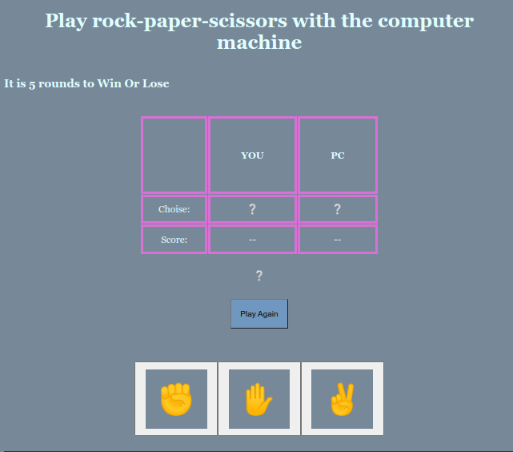

</br>
</br>

We use : 

 


</br>
</br>

You can <a href="https://omar-alzant.github.io/ROCK-PAPER-SCISSORS/">Try it </a>.

***

The result : 



***

</br>
</br>

## Understanding : 

Rock paper scissors game where you play against the computer.

- What I learned

1- how to randomly select items out of an array

2- how to animate words (by splitting each individual character into their own span)

3- how to use .animate()
you can use a variable in place of document to select a query.


***

</br>
</br>

Code -HTML- :

```html

<!DOCTYPE html>
<html lang="en">
<head>
    <meta charset="UTF-8" />
    <meta name="viewport" content="width=device-width, initial-scale=1.0" />
    <link href="css/style.css" rel="stylesheet" >
    <meta name="viewport" content="width=device-width, initial-scale=1, shrink-to-fit=no"/> 
    

    <title>R-P-S</title>

</head>
<body>
   
    <nav class=" navbar">
        <div class="header-logo">
            
        </div>
        <div class="header-link">
            <a href="#">About</a>
            <a href="#">Shop</a>
            <a href="other page/contact.html">Contact</a>                    
        </div>
    </nav>

   <div class="header">
    
    <h1> Play rock-paper-scissors with the computer machine  </h1>
    <h3> It is 5 rounds to Win Or Lose</h3>

   </div>


<table>

    <tr>
        <th>     </th>
        <th> YOU </th>
        <th> PC </th>
    </tr>
    <tr> 
        <td> Choise: </td>
        <td ><div id="choice1" >❔</div></td>
        <td ><div id="choice2" >❔</div></td>
    </tr>
    <tr> 
        <td> Score: </td>
        <td id="score1"> -- </td>
        <td id="score2"> -- </td>
    </tr>
</table>

<div id="winner"  style="margin-top: 25px;"> ❔ </div>


    <button class="reset" ><div id="reset" > Play Again</div> </button>


<div class="content">
    <button>
        <div class="btn" id="rock"> &#9994</div>
    </button>
    <button>
        <div class="btn" id="paper"> &#9995 </div> 
    </button>   
    <button>
        <div class="btn" id="scissors"> &#9996 </div>
    </button>    
</div>


<footer>
    <div class="footer">
        <h5>
          <i class="fa fa-copyright"></i>
          Created By Omar Jamal Alzant 2021
        </h5>
      </div>

</footer>

<script src="js/r-p-s.js"  ></script>

</body>
</html>
```
***

</br>
</br>


Code -CSS- :

```css
:root{
    --c1 : lightslategray;
    --c2 :  rgb(174, 197, 220);
}

body{
    background-color: var(--c1);
    color: lightcyan;
    font-size: medium;
    font-family: Cambria, Cochin, Georgia, Times, 'Times New Roman', serif;
    text-align: center;
    padding: 10px;
    margin: 10px;
}

.navbar {
    display: flex;
    color: #F9FAF8;
    background-color: #1F2937;
    padding: 20px 0px 20px 25px;
    align-items: center;
}

.header-link {
    display: flex;
    margin-left: auto;
    padding: 0px 50px 0px 0px;  
}

.header-link a {
    text-decoration: none;
    color: #E5E7EB;
    font-size: 18px;
    padding: 10px;
    font-family: 'Roboto', arial;
}
.header-logo img {

    width: 50px;
    height: 50px;
    margin-right: auto;
}

.header{
    text-align: center;
    display: flex;
    align-items: flex-start;
    justify-content: center;
    flex-direction: column ;
    margin-bottom: 25px;    
}


table{
    display: flex;
    justify-content: center;
    align-items: center;   

}


table th{
    padding: 50px;
    border: 5px solid orchid;
    
}

table td{
    border: 5px solid orchid;
    text-align: center;
    padding: 10px;

}

td th {
    width: 500px;
    height: 500px;
}

.reset{
        margin: 30px;
        padding: 15px;
        background-color: rgb(112, 151, 191);
        color: rgb(2, 2, 2);
}
.reset:hover{
    background-color: rgb(119, 135, 150);
}

.content{
    display: flex;
    flex-direction: row;
    padding: 5px;
    margin: 20px 20px; 
    justify-content: center;
}

.btn{
    font-size: 50px;
    padding: 20px;
    margin: 10px;
    gap: 50px;
    background-color: var(--c1);
}

.btn:hover{
    background-color: var(--c2);
}


footer {
    display: flex;
    align-items: center;
    justify-content: center;
    background-color: rgb(32, 51, 70);
  }

```

***

</br>
</br>

Code -JS- :

```javascript

let playerScore = 0;
let pcScore = 0;
const reset = document.getElementById("reset");


function compareVal(playerVal, pcVal) {
  if (playerVal === pcVal) {
    win.textContent = " Same result";
  }

  if (
    (playerVal === "ROCK" && pcVal === "SCISSORS") ||
    (playerVal === "PAPER" && pcVal === "ROCK") ||
    (playerVal === "SCISSORS" && pcVal === "PAPER")
  ) {
    playerScore++;
    win.textContent = "You are Win";
  }
  if (
    (pcVal === "ROCK" && playerVal === "SCISSORS") ||
    (pcVal === "SCISSORS" && playerVal === "PAPER") ||
    (pcVal === "PAPER" && playerVal === "ROCK")
  ) {
    pcScore++;
    win.textContent = "Pc is Win";
  }
}


function randPc() {
  let rand = Math.floor(Math.random() * 3);

  switch (rand) {
    case 0:
      return 'ROCK';
    case 1:
      return 'PAPER';
    case 2:
      return 'SCISSORS';
  }
}


const c2 = document.getElementById("choice2");
const c1 = document.getElementById("choice1");

const s1 = document.getElementById("score1");
const s2 = document.getElementById("score2");

const win = document.getElementById("winner");

const rockBtn = document.getElementById("rock");
const paperBtn = document.getElementById("paper");
const scissorsBtn = document.getElementById("scissors");

rockBtn.addEventListener('click' , () => handleClick('ROCK'));
paperBtn.addEventListener('click' , () => handleClick('PAPER'));
scissorsBtn.addEventListener('click' , () => handleClick('SCISSORS'));
reset.addEventListener('click', playAgain);

function playAgain(){
  window.location.reload();
}

function checkScore(player,pc){

  if(player === 5 || pc === 5 )
  {
    if(player === 5 )
    {
      document.getElementById("winner").style.display = 'flex';
      document.getElementById("winner").style.blockSize = '100px';
      document.getElementById("winner").style.textAlign = '50px';
      document.getElementById("winner").style.alignItems = 'center';
      document.getElementById("winner").style.justifyContent = 'center';
      document.getElementById("winner").style.background = 'rgb(174, 197, 220)';
      document.getElementById("winner").textContent = 'YOU WIN';

    }
    else{
      document.getElementById("winner").style.display = 'flex';
      document.getElementById("winner").style.blockSize = '100px';
      document.getElementById("winner").style.textAlign = '50px';
      document.getElementById("winner").style.alignItems = 'center';
      document.getElementById("winner").style.justifyContent = 'center';
      document.getElementById("winner").style.background = 'rgb(174, 197, 220)';
      document.getElementById("winner").textContent = 'PC WIN';
    }
  }
  if(player > 5 || pc > 5 )
  {
 playAgain();

  }
}


function updateChoice(playerVal, pcVal) {
  switch (pcVal) {
    case 'ROCK':
      c2.innerHTML = "✊";
      break;
    case 'PAPER':
      c2.innerHTML = "✋";
      break;
    case 'SCISSORS':
      c2.innerHTML = "✌";
      break;
  }

  switch (playerVal) {
    case 'ROCK':
      c1.innerHTML = "✊";
      break;
    case 'PAPER':
      c1.innerHTML = "✋";
      break;
    case 'SCISSORS':
      c1.innerHTML = "✌";
      break;
  }
}


function handleClick(playerChoise) {
  checkScore(playerScore,pcScore);    

  const PChoise = randPc();
  updateChoice(playerChoise,PChoise);
  compareVal(playerChoise,PChoise);

      s1.innerHTML = playerScore;
      s2.innerHTML = pcScore;
  checkScore(playerScore,pcScore);    

  }

```


