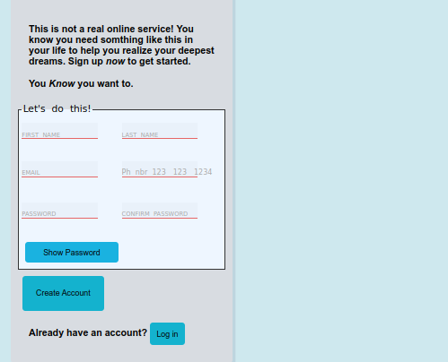

</br>
</br>

We use : 


***

</br>
</br>

You can 
<a href="https://omar-alzant.github.io/Sign-Up-Form/">
    Test-it
</a>.

***

</br>
</br>

The result :



***

</br>
</br>


Code -CSS- :

```css

@font-face {
  font-family: my-cool-font ;
  src: url(/css/font.css);
}
:root{
      --login : 1vw;
      --create : 2vw;
} 

body {
      display: grid;
      grid-template-columns: 37% 60%;
      background-color: rgb(206, 232, 238);
}

.form {
      margin-top: 25px;
      box-shadow: 5px 5px rgba(50, 50, 93, 0.1);
      border-radius: 5px;
      display: flexbox;
      padding: 10px;
      background-color: rgb(216, 220, 225);
      margin-bottom: 20px;
      margin-left: 25px;
      }

img {
      box-shadow: 5px 5px rgba(21, 21, 22, 0.15);
      border-radius: 5px;
    }

p {
      margin: 20px;
      margin-top: 10px;
      font-family: 'Roboto', sans-serif;
      font-weight: bold;
}
  
fieldset {
      padding: 5px;
      border: 1px solid #333;
      box-sizing: border-box;
      display: grid;
      grid-template-columns: minmax(15px,1fr) minmax(15px,1fr);
      background-color: rgb(238, 246, 255);
}


input:valid {
  /* box-shadow: 0 0 5px 1px rgb(127, 196, 100); */
  border-color: rgb(127, 196, 100);
}

input:invalid {
  /* box-shadow: 0 0 5px 1px rgb(230, 102, 102); */
  border-color: rgb(230, 102, 102);
}

/* input:focus:invalid{
    box-shadow: none;
} */


/* ***************** INPUTs setting ********************* */

.group {
  margin-bottom: 1em;
  transition: all 0.3s;

}
.label[for='in4']{
  font-size: 12px;
}
.label {
  font-size: 10px;
  color: #aaa;
  display: block;
  opacity: 1;
  transform: translateY(-1.6em);
  transform-origin: 1 0;
  transition: all 0.3s;
}

.control {
  box-shadow: none;
  background-color: rgba(0, 0, 0, 0.02);
  border-radius: 0px;
  border-color: #ccc;
  border-style: none none solid none;
  width: 70%;
  transition: all 0.5s;
  padding: 5px;
}

.control::placeholder {
  color: transparent;
}
.control:focus {
  box-shadow: none;
  outline: none;
}

.control:focus + .label,
.control:not(:placeholder-shown) + .label {
  transform: translate(-1em) scale(0.8);
}

label {
  font-size: xx-small;
}

/* ********************************************************** */

#p1 {
  margin-top: 60px;
  max-width: 80ch;
}


/* ******************** Show/Hide pwd ******************** */

.btn{
    padding: var(--create);
    margin: 10px;
}

.login{
    padding: var(--login);
}


.btn,
.login {
  background-color: rgb(20, 178, 206);
  border: none;
  border-radius: 5px;
}

.visually-hidden {
  /* position: absolute !important; */
  /* width: 1px !important; */
  /* height: 1px !important; */
  /* margin: 0 !important;
 /* padding: 0 !important; */
  /* overflow: hidden !important; */
  /* clip: rect(0 0 0 0) !important; */
  -webkit-clip-path: inset(50%) !important;
  clip-path: inset(50%) !important;
  /* border: 0 !important; */
  white-space: nowrap !important;
}

/* .has-js::-ms-reveal {
  display: none;
}
.has-js::reveal {
  display: none;
} */

.reveal-password {
  /* width: var(--show); */
  padding: 10px;
  text-transform: capitalize;
  border: none;
  background: rgb(26, 178, 224);
  border-radius: 5px;
  display: inline-grid; 
  grid-template-columns: auto;
  grid-template-rows: auto;
  margin: 5px;
}

.reveal-password:before {
  content: attr(data-text-show);
  grid-area: 1 / 1;
  height: 0px;
  visibility: hidden;
}


@media only screen and (max-width: 650px) {
  body {
    background-color: rgb(242, 239, 86);
  }
  fieldset{
    display: block;
  }
  .form{
    width: 100%;
    /* overflow: scroll; */
  }
  .label{
    font-size: 10px;
  }
  p{
    font-size: 10px;
  }
}

```

***

</br>
</br>

Code -JS- :

```javascript

const revealPassword = document.querySelector('.reveal-password');
const passwordField1 = document.querySelector('#password');
const passwordField2 = document.querySelector('#pwdconfirm');
const passwordAnnounce = document.querySelector('.password-announce');

if (revealPassword && passwordField1 && passwordField2 && passwordAnnounce) {
  revealPassword.hidden = false;
  passwordField1.classList.add('has-js');
  passwordField2.classList.add('has-js');

  
  revealPassword.addEventListener('click', (event) => {
    let isPressed = revealPassword.getAttribute('data-pressed') === 'true';
    if (isPressed) {
    passwordField1.type = 'password';
    passwordField2.type = 'password';
      revealPassword.innerText = revealPassword.dataset.textShow;
      passwordAnnounce.innerText = passwordAnnounce.dataset.textHidden;
    } else {
    passwordField1.type = 'text';
    passwordField2.type = 'text';
    revealPassword.innerText = revealPassword.dataset.textHide;
      passwordAnnounce.innerText = passwordAnnounce.dataset.textShown;
    }
    revealPassword.setAttribute('data-pressed', String(!isPressed));
  });
   
}


const pwd = document.querySelector('#password');
const confpwd = document.querySelector('#in6');
let count = 0;

document.addEventListener("DOMContentLoaded",()=>{

     check = function(e){
        if(this.password.value == this.pwdconfirm.value){
            count = 0;
            return ;
        }
        else{
            if(count == 3)
            alert("Error: Please check that you've entered and confirmed your password!");
        count++;    
        }
    };
    var myForm = document.getElementById("myForm");
    myForm.addEventListener("submit", check, true);
});

```

***

</br>
</br>

Code -Html- :


```html

<!DOCTYPE html>
<html lang="en">
<head>
    <meta charset="UTF-8">
    <meta http-equiv="X-UA-Compatible" content="IE=edge">
    <meta name="viewport" content="width=device-width">
    
    <link rel="stylesheet" href="css/style.css">

    <title>Sign-Up-Form</title>
</head>
<body>

        
        <!--  -->

        <div class="form" style="float: right;">
            <p id="p1">This is not a real online service! You know you need somthing like this in your 
                life to help you realize your deepest dreams. 
            Sign up <em>now</em> to get started. </p>

            <p> You <em>Know</em> you want to.</p>

            <form action="" id="myForm" method="post">
                <fieldset>
                    <legend>Let's do this!</legend>
                        <!-- First name -->
                <div class="group">
                    <input type="text" class="control" placeholder="Your Name" name="fist-name" id="in1" required>
                    <label for="in1" class="label" >FIRST NAME</label>

                </div>
                        <!-- Last name -->
                <div class="group">
                    <input type="text" class="control" placeholder="Your Last" name="last-name" id="in2" required>
                    <label for="in2" class="label" >LAST NAME</label>
                </div>
                        <!-- Email -->
                <div class="group">
                    <input type="email" class="control" name="email" id="in3" placeholder="example@email.com" required pattern="[\w\.]+@[a-z]+\.[a-z]{3}">
                    <label for="in3" class="label">EMAIL</label>
                </div>
                        <!-- Phone -->
                <div class="group">
                    <input type="tel" autocomplete="address-level4" class="control" name="phone" id="in4" placeholder=" " required pattern="[0-9]{3}-[0-9]{3}-[0-9]{4}">
                    <label for="in4" class="label">Ph nbr 123-123-1234</label>
                </div>    
                
                        <!-- pwd -->
                <div class="group">
                    <input type="password" class="control" placeholder=" " name="pwd" id="password" required pattern="[\w]{8,}">
                    <label for="password" class="label">PASSWORD</label>
                </div>

                 <div class="group">
                    <input type="password" class="control" placeholder=" " name="conf" id="pwdconfirm" required pattern="[\w]{8,}">    
                    <label for="pwdconfirm" class="label">CONFIRM PASSWORD</label>
                </div>  
                                        
                <button type="button" 
                             hidden data-pressed="false"
                             class="reveal-password" 
                             aria-controls="password"
                             data-text-show="Show password"
                             data-text-hide="Hide password">
                                Show password

                    <span data-text-shown="Your password is shown"
                          data-text-hidden="Your password is hidden"
                          class="visually-hidden password-announce"
                          aria-live="polite">
                        </span>
                    </button>

                </fieldset>

                <button class="btn" >Create Account</button>
            </form>

            <p>Already have an account? <a href="#"> <button class="login">Log in</button> </a> </p>
        
            </div>
        

    <script src="js/script.js"></script>
</body>
</html>
```


</br>
</br>
