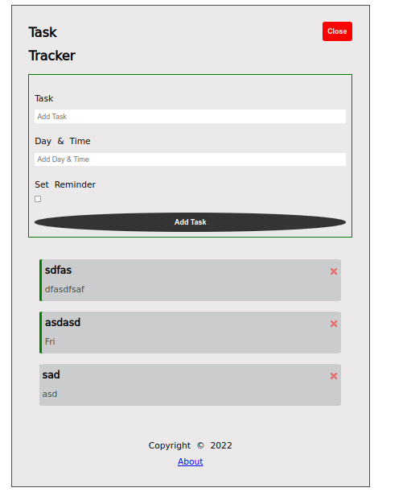
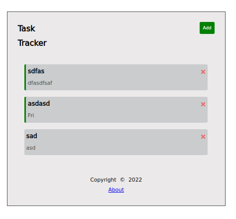
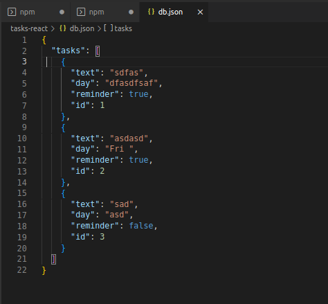

</br>
</br>

## Introduction to React :

React is one of the most powerful, widely used frontend frameworks.

The landscape for frontend frameworks has been changing a lot over the last few years, so it is understandable to be worried about choosing the “wrong” one. This [article](https://stackoverflow.blog/2018/01/11/brutal-lifecycle-javascript-frameworks/) shows the recent development of frontend frameworks well. Once you start diving deeper into a framework, you will begin to love it. It makes your code easily scalable, more readable, and possibly a thousand times more efficient (just our modest estimation).


- Just to name a few reasons on why to learn React.js:

-- Reusability of components.

-- Well supported due to its popularity

-- React is not opinionated, which means that it won’t force you to follow any specific design patterns, project organizational structure, or logic. It’s all up to you.

-- Smaller learning curve, especially when you already have a good grasp of JavaScript and HTML from our previous lessons.


**For More about React visit this** [lesson](https://www.theodinproject.com/lessons/node-path-javascript-react-introduction).


***

</br>
</br>

The Result :



</br>



</br>



***

</br>
</br>

##  Usage :

### Install dependencies 

```
npm install

```

### Run React dev server ( [http://localhost:3000](http://localhost:3000) )

```
npm start

```

### Run the JSON server ( [http://localhost:5000](http://localhost:3000) )

```

npm run server

```

### To build for production :

```

npm run build

```

*** 

</br>
</br>


## Steps :

We have to create  some **JS** Files on the **src** folder ( divide the project to components ) :

{ We use the hooks in all this files, for more about [Hooks-1-](https://web.archive.org/web/20210614125842/https://blog.ohansemmanuel.com/react-hooks-documentation-easy-to-read/) 

[Hooks-2-](https://www.youtube.com/watch?v=-MlNBTSg_Ww) }

***


1- Component files: 

- **About.js**, contain simple idea like the version, some info about this project.

- **AddTask.js**, Contain an add task form, when it is submited, sent information is saved.


- **Button.js**, Add/Close the addTask form .

- **Tasks.js**, Display the saved data in the task buffer.

- **Footer.js**, Display the footer.

- **Header**, Display the header (Contain Button and title).

- **Style.css**, style of project.

2- **App.js**, Collect and send Files to index ( Contain the analytical functions to be sent to the Components).

3- **Index.js**, Import data from App and Render it.


***

</br>
</br>

## Important :

> In package.json; we add to script object a JSON server to save the tasks on a db.json file ( we choose a port for it ).

***

</br>
</br>

## Codes ::


Code -About.js-:

```javascript

import { Link } from 'react-router-dom'

const About = () => {
  return (
    <div className='about'>
        <h4>Version 1.0.0</h4>
        <Link to='/tasks-add-react'>Go back</Link>
    </div>
  )
}

export default About

```

***

</br>
</br>

Code -AddTask.js- :

```javascript 

import { useState } from "react"

const AddTask = ({ onAdd }) => {
    const [text,setText] = useState('');
    const [day,setDay] = useState('');
    const [reminder,setReminder] = useState(false);

    const onSubmit = (e) => {
        e.preventDefault();
        
        if(!text){
            alert('Please add a Task !! ');
            return;
        }
        onAdd({ text, day, reminder})
        setText('')
        setDay('')
        setReminder(false)
    }
  return (
    <form onSubmit={ onSubmit } >
        <label htmlFor="Taskname"> Task </label>
        <input type="text" id="Taskname" value={text} placeholder="Add Task"
                onChange={(e)=>setText(`${e.target.value}`)}
                 />

        <label htmlFor="Taskday"> Day & Time</label>
        <input type="text" id="Taskday" value={day} placeholder="Add Day & Time"
                onChange={(e)=>setDay(`${e.target.value}`)}
                />

        <label htmlFor="Reminder"> Set Reminder</label>
        <input type="checkbox" id="Reminder" value={reminder} checked={reminder} onChange={(e)=>setReminder(e.currentTarget.checked)}/>

        <input type="submit" value="Add Task"  className="btn-add"/>
    </form>
  )
}

export default AddTask

```

***

</br>
</br>

Code -Button.js- :

[**prop-types**](https://reactjs.org/docs/typechecking-with-proptypes.html) 

***

</br>

```javascript

import PropTypes from 'prop-types'

const Button = ({color, text, onClick}) => {
  return (
    <button   
        style={{backgroundColor: color}} 
        className="btn"
        onClick={onClick}
        >
        {text}
    </button>
  )
}


Button.defaultProps = {
    color: 'steelBlue',
}

Button.propTypes = {
    text: PropTypes.string,
    color: PropTypes.string,
    onclick: PropTypes.func,
}


export default Button

```

***

</br>
</br>

Code -Tasks.js- :

```javascript 

import './style.css'
import * as React from "react";

function FaTimes(props) {
  return <svg stroke="currentColor"  style={{color: 'rgba(239, 85, 85, 0.822)',cursor:"pointer" }} fill="currentColor" strokeWidth={0} viewBox="0 0 352 512" height="1em" width="1em" {...props}><path d="M242.72 256l100.07-100.07c12.28-12.28 12.28-32.19 0-44.48l-22.24-22.24c-12.28-12.28-32.19-12.28-44.48 0L176 189.28 75.93 89.21c-12.28-12.28-32.19-12.28-44.48 0L9.21 111.45c-12.28 12.28-12.28 32.19 0 44.48L109.28 256 9.21 356.07c-12.28 12.28-12.28 32.19 0 44.48l22.24 22.24c12.28 12.28 32.2 12.28 44.48 0L176 322.72l100.07 100.07c12.28 12.28 32.2 12.28 44.48 0l22.24-22.24c12.28-12.28 12.28-32.19 0-44.48L242.72 256z" /></svg>;
}


const Tasks = ({ tasks, onDelete, onToggle }) => {
    return(
        <div className="task-cont">
        {tasks.map((task) => (

            <div 
                key={`${task.id}`}  
                className={`task ${task.reminder ? 'reminder' : ''}`}  // other method to hide/view the style
                onDoubleClick={()=> onToggle(task.id)}
                 >

                <h3>{task.text} 
                <FaTimes onClick={()=> onDelete(task.id)}/></h3>
                <p>{task.day}</p>

            </div>
        ))}
        </div>
    );
}

export default Tasks;


```

***

</br>
</br>


Code -Style.css- :  (We explain other method to create styles in React in a external blogs ).

```css

:root{
    --bck : rgb(235, 233, 233);
    --w : 45vw;
}

*{
    margin: 0;
    padding: 0;
}

.cont{
    background-color: var(--bck);
    border: 2px solid rgb(77, 77, 77);
    margin: 2vw;
    padding: 3vw;
    margin-top: 40px;
    max-width: min-content;
}

.header{
    display: flex;
}

.task-cont{
    display: grid;
    height: min-content;
    gap: 20px;
    margin: 2vw;
    margin-top: 40px;
}

.task{
    padding: 5px;
    background-color: rgb(202, 204, 205);
    border-radius: 2%;
}

.task p {
    margin-top: 3px;
    color: rgba(0, 0, 0, 0.663);
}

.task h3{
    display: flex;
    align-items: center;
    justify-content: space-between;
}

.task.reminder{
    border-left: 5px solid green ;
}

.btn{
    border: none;
    padding: 10px;
    border-radius: 10%;
    font-weight: bold;
    color: var(--bck);
    margin-left: calc(var(--w));
    height: min-content;
    cursor: pointer;
}


form{
    display: grid;
    margin-top: 10px;
    padding: 10px;
    border: 1px solid green;
}

form label {
    margin-bottom: 5px ;
    margin-top: 20px;
}

form input {
    border: none;
    padding: 5px;
    border-radius: 2px;
}

.btn-add{
    border: none;
    padding: 10px;
    border-radius: 70% 70%;
    font-weight: bold;
    margin-top: 20px;
    background-color: rgb(53, 52, 52);
    color: white;
    height: min-content;
    cursor: pointer;
}

footer, .about{
    margin-top: 60px;
    display: grid;
    align-items: center;
    justify-content: center;
    justify-items: center;
}

```
***

</br>
</br>

Code -Footer.js- :

```javascript

import { Link } from 'react-router-dom'
 
const Footer = () => {
  return (
    <footer>
        <p>Copyright &copy; 2022</p>
        <Link to="/about">About</Link>
    </footer>
  )

 
}

export default Footer

```

***

</br>
</br>

Code -Header.js- :

```javascript

import './style.css'
import PropTypes from 'prop-types'
import Button from './Button'


const Header = ({title, onAdd, showAddTask}) => {
    return (
    <header className="header">
    
    {/* <h2 style={headingStyle}>{title}</h2> */}
        
        <h2>{title} </h2>
        {
             <Button  
                color={showAddTask ? 'red' : 'green'}
                text={showAddTask ? 'Close' : 'Add'} 
                onClick={onAdd}/>
        }
    </header>
  )
}


Header.defaultProps={
    title: 'Task Tracker',
}

// const headingStyle = {
//     color: "red",
//     backgroundColor: "black",
// }


Header.propTypes = {
    title: PropTypes.string.isRequired,
    // so we cannot send without string to title in header
}
export default Header

```

***

</br>
</br>

Form of db.json file (  one task ):

```json
{
  "tasks": [
    {
      "text": "React lesson -lifecycle-",
      "day": "Fri 8/8/22 at 9:00 am",
      "reminder": true,
      "id": 1
    }
  ]
}

```

***

</br>
</br>

Code -App.js- :

[**Routes-1-**](https://www.youtube.com/watch?v=QUz3k2O3ZJU)
</br>

[**Routes-2-**](https://css-tricks.com/learning-react-router/)

```javascript

import { useEffect, useState } from "react";
import { BrowserRouter as Router, Route, Routes } from "react-router-dom";
import Header from "./components/Header";
import Tasks from "./components/Tasks";
import AddTask from "./components/AddTask";
import Footer from "./components/Footer";
import About from "./components/About";
import "./components/style.css";

function App() {
  const [tasks, setTasks] = useState([]);

  const [showAddTask, setShowAddTask] = useState(false);

  useEffect(() => {
    const getTasks = async () => {
      const tasksFromServer = await fetchTasks();
      setTasks(tasksFromServer);
    };

    getTasks()
  }, []);

  // Fetch Data
  const fetchTasks = async () => {
    const res = await fetch("http://localhost:5000/tasks");
    const data = await res.json();

    return data;
  };

  // Fetch Data
  const fetchTask = async (id) => {
    const res = await fetch(`http://localhost:5000/tasks/${id}`);
    const data = await res.json();

    return data;
  };

  // Toggle Reminder

  //  without JSON

  // const toggleReminder = (id) => {
  //   // console.log(id);
  //   setTasks(
  //     tasks.map((task) =>
  //       task.id === id ? { ...task, reminder: !task.reminder } : task
  //     )
  //   );
  // };

  // with JSON

  const toggleReminderJSON = async (id) => {
    const taskToToggle = await fetchTask(id);
    const updTask = { ...taskToToggle, reminder: !taskToToggle.reminder };

    const res = await fetch(`http://localhost:5000/tasks/${id}`, {
      method: "PUT", // update
      headers: {
        "Content-type": "application/json",
      },
      body: JSON.stringify(updTask),
    });

    const data = await res.json();

    setTasks(
      tasks.map((task) =>
        task.id === id ? { ...task, reminder: data.reminder } : task
      )
    )
  };

  // Add Tasks

  // without Json
  // const addTask = (task) => {
  //   let id = Math.floor(Math.random() * 10000) + 1;
  //   const newTask = { id, ...task };
  //   setTasks([...tasks, newTask]);
  // };

  // with JSON

  const addTaskJSON = async (task) => {
    const res = await fetch("http://localhost:5000/tasks", {
      method: "POST",
      headers: {
        "Content-type": "application/json",
      },
      body: JSON.stringify(task),
    });

    const data = await res.json();

    setTasks([...tasks, data]);
  };

  //////////////////////////////////

  // Delete Tasks from JSON

  // without JSON

  // Delete Task
  // const deleteTask = (id) => {
  //   // console.log("delete",id);
  //   setTasks(tasks.filter((task) => task.id !== id));
  // };

  // with JSON

  const deleteTaskJSON = async (id) => {
    const res = await  fetch(`http://localhost:5000/tasks/${id}`, {
      method: "DELETE",
    });

    res.status === 200 
    ? setTasks(tasks.filter((task)=>task.id !== id))
    : alert('Error Deleting this Task')
  }

  ///////////////////////////////////////////////

  return (
    <Router>
      <div className="cont">
        <Header
          onAdd={() => setShowAddTask(!showAddTask)}
          showAddTask={showAddTask}
        />
        <Routes>
          <Route
            path="/tasks-add-react"
            element={
              <>
                {showAddTask && <AddTask onAdd={addTaskJSON} />}
                {tasks.length > 0 ? (
                  <Tasks
                    tasks={tasks}
                    // onDelete={deleteTask}
                    onDelete={deleteTaskJSON}
                    onToggle={toggleReminderJSON} 

                  />
                ) : (
                  "No Tasks To Show"
                )}
              </>
            }
          />
          <Route path="/about" element={<About/>}/>
        </Routes>            
        <Footer />
      </div>
    </Router>
  );
}

export default App;


```


***

</br>
</br>

Code -index.js- :

```javascript

import React from 'react';
import ReactDOM from 'react-dom/client';
import App from './App';
const root = ReactDOM.createRoot(document.getElementById('root'));
root.render(
        <React.StrictMode>
            <App />
        </React.StrictMode>
);

```