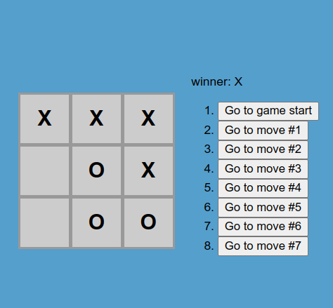

</br>
</br>

## Introduction to React :

React is one of the most powerful, widely used frontend frameworks.

The landscape for frontend frameworks has been changing a lot over the last few years, so it is understandable to be worried about choosing the “wrong” one. This [article](https://stackoverflow.blog/2018/01/11/brutal-lifecycle-javascript-frameworks/) shows the recent development of frontend frameworks well. Once you start diving deeper into a framework, you will begin to love it. It makes your code easily scalable, more readable, and possibly a thousand times more efficient (just our modest estimation).


- Just to name a few reasons on why to learn React.js:

-- Reusability of components.

-- Well supported due to its popularity

-- React is not opinionated, which means that it won’t force you to follow any specific design patterns, project organizational structure, or logic. It’s all up to you.

-- Smaller learning curve, especially when you already have a good grasp of JavaScript and HTML from our previous lessons.


**For More about React visit this** [lesson](https://www.theodinproject.com/lessons/node-path-javascript-react-introduction).


***

</br>
</br>

The Result :




***

</br>
</br>

##  Usage :

### Install dependencies 

```
npm install

```

### Run React dev server ( [http://localhost:3000](http://localhost:3000) )

```
npm start

```
</br>


### To build for production :

```

npm run build

```

*** 

</br>
</br>


## Steps :

This project is divide to some parts :

1- Board: The palce where the user enter his choice -UI- .

2- Square : A Function Listener, when the user click the square of board, it display his choice.

3- Game : Contain the Functions  of handling, and return the Board class.

4- calculateWinner :  function  calcule when Clicking the square, the possible winner.

</br>
</br>

## Important :

> In this project we use the State & Props instead of Hooks.

</br>
</br>

## Codes ::


Code -index.js- :

```javascript

import React from "react";
import ReactDOM from "react-dom/client";
import "./index.css";

//    State

// As a next step, we want the Square component to “remember” that
// it got clicked, and fill it with an “X” mark.
//  To “remember” things, components use state.

// React components can have state by setting this.state in their
//  constructors. this.state should be considered as private to a
// React component that it’s defined in. Let’s store the current
//  value of the Square in this.state, and change it when the Square
//  is clicked.

// First, we’ll add a constructor to the class to initialize
// the state:

////////////////////////////////

// In JavaScript classes, you need to always call super when
//  defining the constructor of a subclass.
// All React component classes that have a constructor should
// start with a super(props) call.

//    *******  Code :  ******
// class Square extends React.Component {

//   render() {
//     return (
//       <button
//         className="square"
//         onClick={() => {
//           this.props.onClick(); }} >
//         {this.props.value}
//       </button>
//     );
//   }
// }

// *********************************

// In React,

// function components are a simpler way to write components
//  that only contain a render method and don’t have their own state.
//   Instead of defining a class which extends React.Component,
//   we can write a function that takes props as input and returns what
//    should be rendered. Function components are less tedious to write
//    than classes, and many components can be expressed this way.

//    Square to function

const Square = (props) => {
  return (
    <button className="square" onClick={props.onClick}>
      {props.value}
    </button>
  );
};

/////////////////////////////////

//////////////////////////////////

class Board extends React.Component {
  renderSquare(i) {
    return (
      <Square
        value={this.props.squares[i]}
        onClick={() => {
          this.props.onClick(i);
        }}
      />
    );
  }

  render() {
    return (
      <div>
        <div className="board-row">
          {this.renderSquare(0)}
          {this.renderSquare(1)}
          {this.renderSquare(2)}
        </div>
        <div className="board-row">
          {this.renderSquare(3)}
          {this.renderSquare(4)}
          {this.renderSquare(5)}
        </div>
        <div className="board-row">
          {this.renderSquare(6)}
          {this.renderSquare(7)}
          {this.renderSquare(8)}
        </div>
      </div>
    );
  }
}

class Game extends React.Component {
  constructor(props) {
    super(props);
    this.state = {
      history: [
        {
          squares: Array(9).fill(null),
        },
      ],
      stepNumber: 0,
      xIsNext: true,
    };
  }

  handleClick(i) {
    // we used slice() to create a new copy of the squares array
    // after every move

    // array.splice() which mutates the original array, and
    // array.slice() which does not mutate the original array
    
    const history = this.state.history.slice(0, this.state.stepNumber + 1);
    const current = history[history.length - 1];
    const squares = current.squares.slice();

    if (calculateWinner(squares) || squares[i]) {
      return;
    }

    // Unlike the array push() method you might be more familiar
    //  with, the concat() method doesn’t mutate the original array,
    // so we prefer it.

    squares[i] = this.state.xIsNext ? "X" : "O";
    this.setState({
      history: history.concat([
        {
          squares: squares,
        },
      ]),
      stepNumber: history.length,
      xIsNext: !this.state.xIsNext,
    });
  }

  jumpTo(step) {
    this.setState({
      stepNumber: step,
      xIsNext: step % 2 === 0,
    });
  }

  render() {
    const history = this.state.history;
    const current = history[this.state.stepNumber];
    const winner = calculateWinner(current.squares);

    const moves = history.map((step, move) => {
      const desc = move ? "Go to move #" + move : "Go to game start";
      return (
        <li key={move}>
          <button onClick={() => this.jumpTo(move)}>{desc}</button>
        </li>
      );
    });

    let status;
    if (winner) {
      status = "winner: " + winner;
    } else {
      status = "Next player: " + (this.state.xIsNext ? "X" : "O");
    }

    return (
      <div className="game">
        <div className="game-board">
          <Board
            squares={current.squares}
            onClick={(i) => this.handleClick(i)}
          />
        </div>
        <div className="game-info">
          <div>{status}</div>
          <ol>{moves}</ol>
        </div>
      </div>
    );
  }
}

// ========================================

const root = ReactDOM.createRoot(document.getElementById("root"));
root.render(<Game />);

const calculateWinner = (squares) => {
  const lines = [
    [0, 1, 2],
    [3, 4, 5],
    [6, 7, 8],
    [0, 3, 6],
    [1, 4, 7],
    [2, 5, 8],
    [0, 4, 8],
    [2, 4, 6],
  ];
  for (let i = 0; i < lines.length; i++) {
    const [a, b, c] = lines[i];
    if (squares[a] && squares[a] === squares[b] && squares[a] === squares[c]) {
      return squares[a];
    }
  }
  return null;
};


```

***

</br>
</br>

Code -index.css- :

```css
body {
    font: 14px "Century Gothic", Futura, sans-serif;
    margin: 20px;
    background-color: rgb(85, 159, 205);
  }
  
  ol, ul {
    padding-left: 30px;
  }
  
  .board-row:after {
    clear: both;
    content: "";
    display: table;
  }
  
  .status {
    margin-bottom: 10px;
  }
  
  .square {
    background: rgb(205, 204, 204);
    border:  solid #999;
    float: left;
    font-size: 24px;
    font-weight: bold;
    line-height: 34px;
    height: 60px;
    width: 60px;
    margin-right: -1px;
    margin-top: -1px;
    padding: 10px;
    text-align: center;
  }
  
  .square:focus {
    outline: none;
  }
  
  .kbd-navigation .square:focus {
    background: #ddd;
  }
  
  .game {
    display: flex;
    flex-direction: row;
    justify-content: center;
    align-items: center;
    height: 100vh;
  }
  
  .game-info {
    margin-left: 20px;
  }
  
  
```

***

</br>
</br>